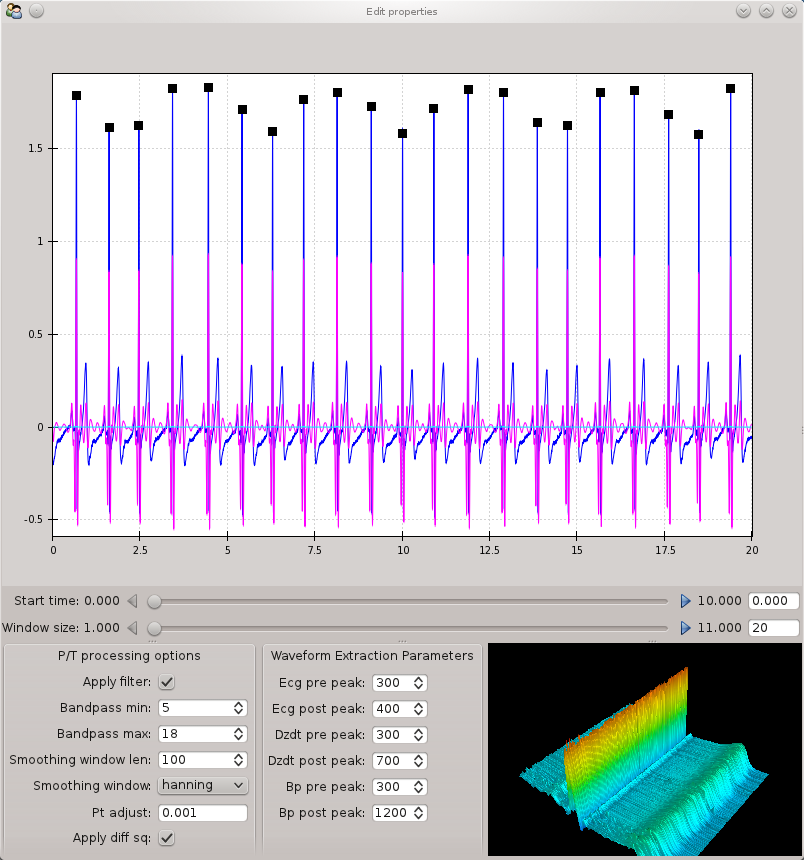

.. _beat-detector: 

Beat Detector
================================

.. toctree::
   :hidden:

In order to calculate each measure of interest (i.e. CO, TPR), MEAP applies a modified 
Pan-Tomkins algoritm to detect each R-peak, or heartbeat, on the ECG wave. This algoritm 
takes the signal (filtered per the specifications below) and squares it to amplify peaks. 
The resulting waveform is then smoothed with a window (see below) to further reduce noise. 
MEAP then detects each peak in the resulting waveform that falls above a certain threshold 
and marks these as R-peaks. 
 

   
The beat detector GUI allows you to: 

	1. Edit the parameters of a modified Pan Tomkins QRS detector 
	2. Set the window of time (in seconds) before and after each heartbeat within which 
		the other points (i.e. b, x, t) should fall. 
		  
**The Pan-Tompkins Method**

The parameters listed under **P/T processing options** (the box in the bottom left corner) 
refer to the filters applied in the Pan-Tomkins beat detector and are as follows:

	*Apply Filter* - unchecking this box will turn off the bandpass filters defined below. 

	*Bandpass filters* - These are intended to reduce the influence of noise due 
	to muscle activity, electrical interference, as well as the misidentification of T-waves
	as R-peaks. This filter selectively reduces the signal where it falls outside the 
	specified range. Values are, therefore, set to the range within which R-peaks are 
	expected to occur. The defaults for the maximum and minimum are set at 5 and 15, 
	respectively, but should be adjusted by the researcher if R-peaks are not correctly 
	detected with these values. 
	
		For Example: if a high peak was missed, the maximum should be adjusted 
		upwards. If secondary peaks (T-waves) were falsely marked as R-peaks, then the 
		minimum value should be adjusted upward. 

	*Smoothing window len* - Specifies the length of the window on which the moving 
	average function that is applied to smooth each waveform. This is done to optimize the
	data for a Fast Fourier Transform (FFT) which converts the signal from the time domain
	into the frequency domain. The default is set at 100. 
	
	*Smoothing window* - Specifies the shape of the smoothing function. 
	The default *Hanning Window* should be used in the majority of cases.  

	*Pt adjust* - Sets the threshold above which R-peaks are detected. This setting can 
	be adjusted from its default value of 0.001 to optimize peak detection. Lower values 
	increase sensitivity and should be used when peaks are missed using the defaults. 

The bottom right corner of this window displays an image of all detected R-peaks lined up
and stacked next to one another. By clicking and mousing over this window, the researcher
can visualize the shape of each heartbeat and quickly get a sense of the consistency and
quality of the data.

**Extracting Waveforms**

The parameters listed under **waveform extraction parameters** refer to the windows of
time surrounding each R-peak within which the other relevant points on each of the 
waveforms are to be found. The values are specified for each waveform in seconds before 
and after the R-peak. The default settings (displayed above) are based on the typical 
temporal arrangement of cardiovascular events, but may be adjusted by the researcher 
where necessary. The parameters specified here are utilized in the next step, 
**Point Marking**.  
