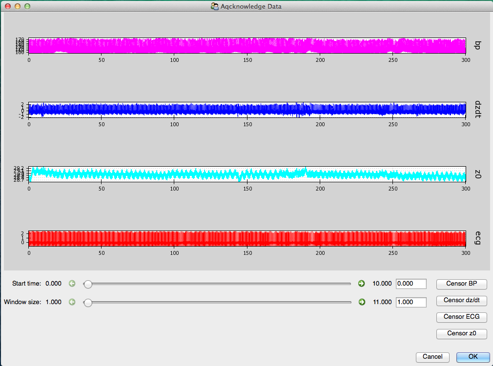
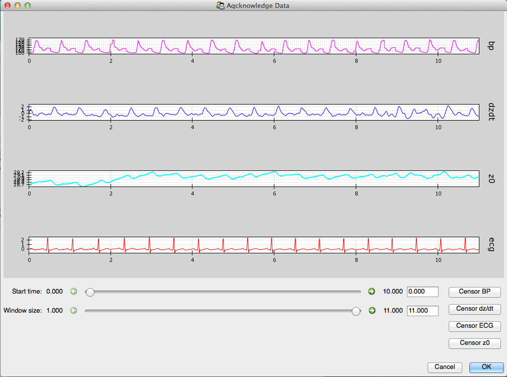
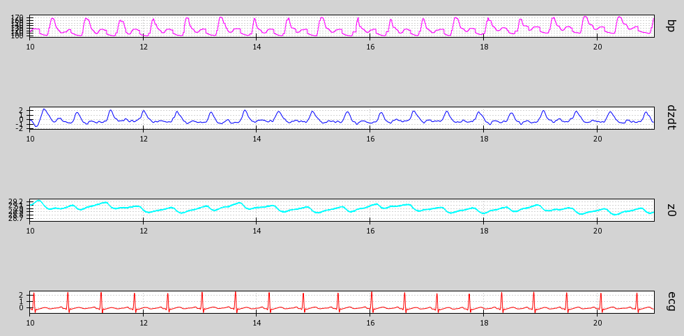
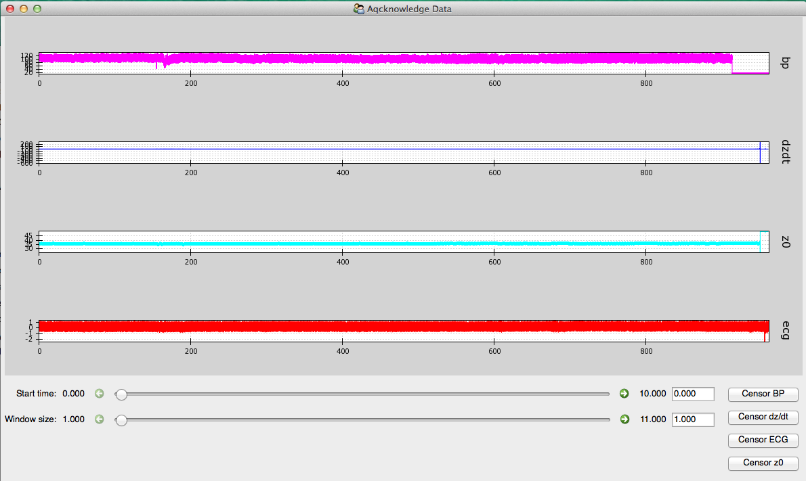

.. _detectartifacts: 

Artifact Detection and Removal
===============================

.. toctree::
   :hidden:
   
Now that you have specified the type of data contained within each channel, MEAP will load
and display this data in a GUI like this:

This feature is designed to allow the user to check the quality of the data and flag any 
segments of data that contain noise or artifacts or that the researcher would like to 
exclude from analyses for whatever reason. Flagged sections will then be removed from 
all future analysis steps including point marking and ensemble averaging. 

.. Warning:: It is critical that all data included in calculations be as clean as possible. 
	Attempting to analyze data with significant artifacts will not yield interpretable values. 

First, use the *Window size* slider at the bottom of the screen to select a widow size that 
optimizes viewing your data. 

Like so:

Using the *Start time* slider you can scroll through the length of your data file. 
Alternatively, you can jump to a specific time point by entering it into the box to the 
right. 

As you scroll through, look for any sections where the waveform deviates significantly 
from it's canonical shape. 

Clean data looks like this: 

   
Artifacts may look like this:

 .. figure:: _static/messy_data.png
   :scale: 70 %
   :alt: messy data
   :align: center

Whenever you come across an area of noise like this, you will want to remove it from 
analyses by censoring it out. This is accomplished using the *Censor* buttons below.
Select the button that matches the waveform you wish to edit, in this case BP. Now use
your curser to highlight the region you would like to exclude. If you would like to remove
multiple regions, simply click on the *Censor BP* again and select another region. 

Do this as necessary for each waveform. It is not necessary to censor region on the Zo or 
Mag wave as this is not used in analyses (the dz/dt wave is the first derivative of Zo and
information from this waveform is used to calculate impedance). 

Large artifacts in your file will impact the scaling and may cause it to look like you do not
have any waveforms.

For example: 

Zooming in, you will see:

.. figure:: _static/messy_data2.png
   :scale: 70 %
   :alt: messy data 2
   :align: center

In these cases...

Once you are satisfied with the regions to be removed, select *OK* to proceed to the next
step: **Detecting R-Peaks**

