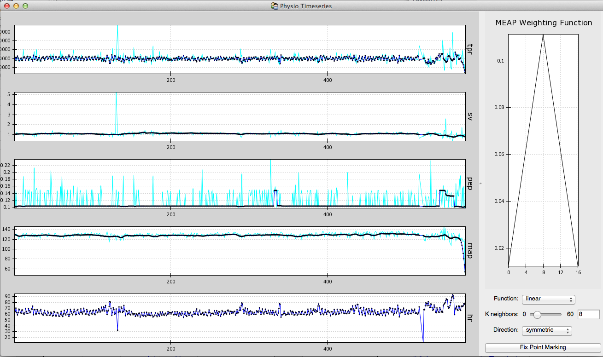
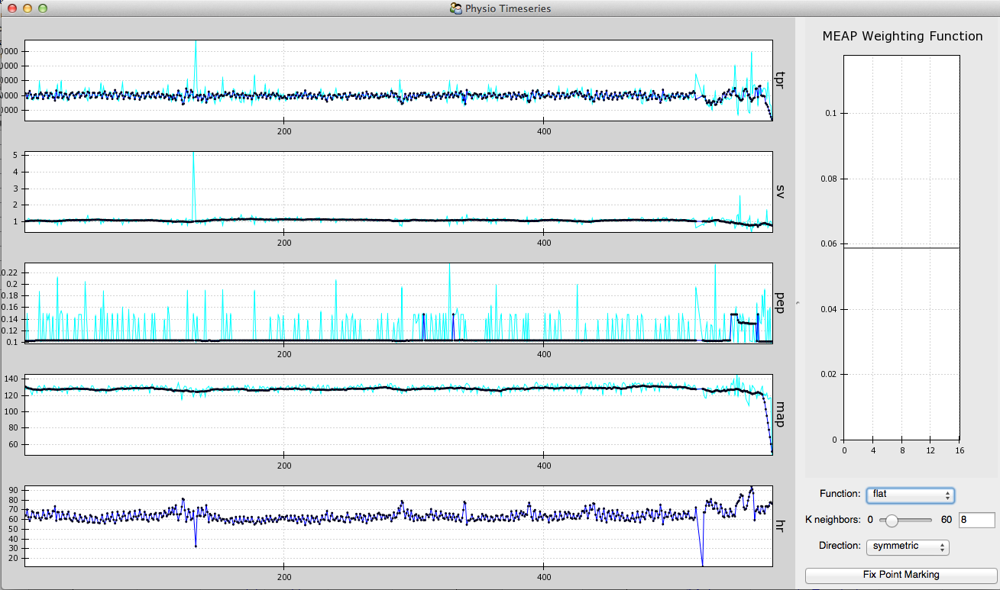
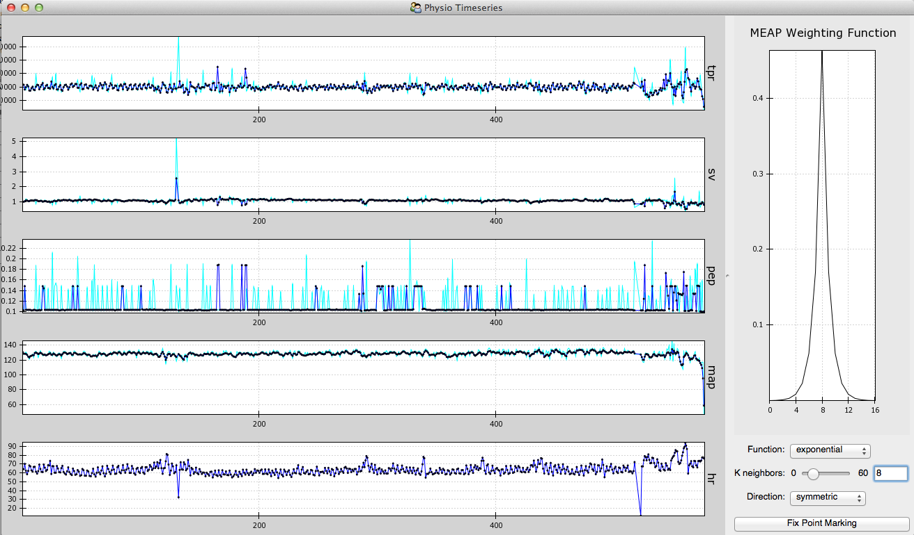
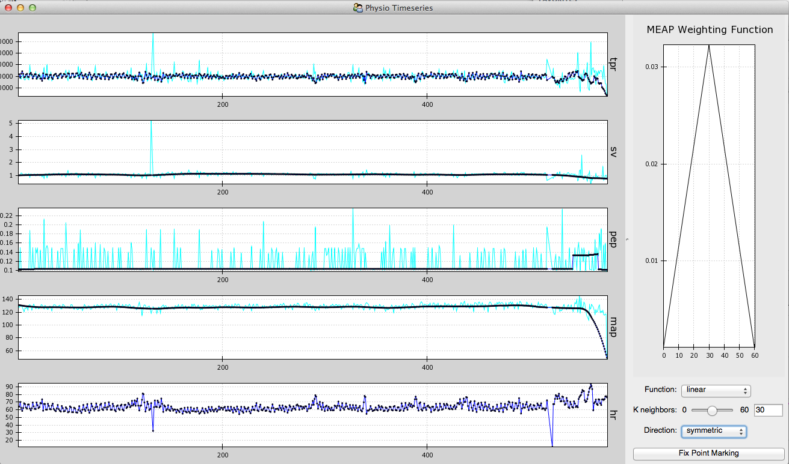
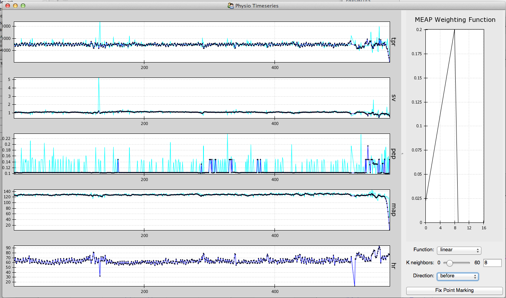
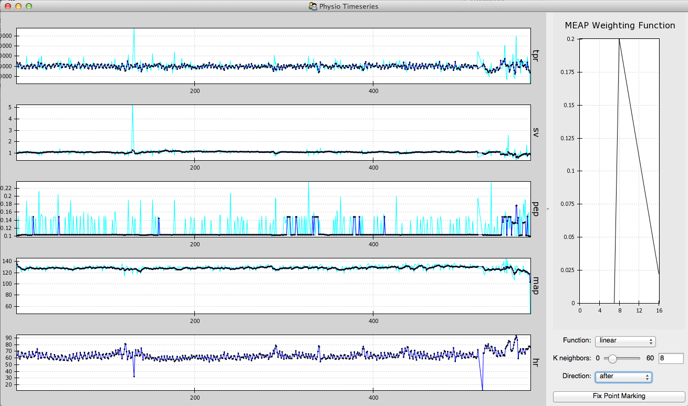

.. _moving-average: 

Calculating the Moving Ensemble Weighted Average
=================================================

.. toctree::
   :hidden:
   
   
MEAP calculates time series data for multiple cardiovascular indices. These are listed and
described below along with the method of calculation employed for each measure. 

    +-----------------------------+-------------------------------+------------------------+ 
    |         Measure             |  Definition                   | Calculation Method     |     
    |                             |                               |                        |           
    +=============================+===============================+========================+ 
    | Total Peripheral Resistance | The total resistance of the   |                        | 
    | (TPR)                       | body's peripheral vasculature |   (MAP/CO) x 80        | 
    |                             |                               |                        | 
    +-----------------------------+-------------------------------+------------------------+ 
    | Cardiac Output  (CO)        | The amount of blood pumped    |    (SV x HR)/1000      | 
    |                             | by the heart per minute       |                        | 
    |                             |                               |                        | 
    +-----------------------------+-------------------------------+------------------------+ 
    | Stroke Volume (SV)          | Volume of blood pumped        | Area under B to X on   | 
    |                             | each beat                     | dz/dt waveform         | 
    |                             |                               |                        | 
    +-----------------------------+-------------------------------+------------------------+ 
    | Pre-Ejection Period (PEP)   | aka Ventricular Contractility | Time between R and B   | 
    |                             | (VC) the force with which the |                        | 
    |                             | left ventrical contracts      |                        | 
    +-----------------------------+-------------------------------+------------------------+ 
    | Mean Arterial Pressure      | Average arterial pressure     | 2/3(DBP) + 1/3(SBP)    | 
    | (MAP)                       | during a cardiac cycle        | DBP=diastolic          | 
    |                             |                               | SBP=systolic           | 
    +-----------------------------+-------------------------------+------------------------+ 
    | Heart Rate  (HR)            | Beats per minute              | # of peaks in the      | 
    |                             |                               | waveform per minute    | 
    |                             |                               |                        | 
    +-----------------------------+-------------------------------+------------------------+ 

MEAP then plots these time-series data. Here you see raw reactivity plotted in cyan. This 
represents beat by beat calculations make without the application of any ensemble averaging
techniques. The black dots represent beat-by-beat values calculated using the ensemble 
average weighted function (selected in the right panel). Blue lines connect these points. 

   
As you can see in this image, the raw data is quite noisy. A moving ensemble averaging 
technique is, therefore, employed to smooth the data while retaining information for each
individual beat. 

The default setting is to apply a *linear* weighting function that weights the 'current'
beat most heavily, and then each neighboring beat by a linearly decreasing function. The
user may alternatively select a *flat* or *exponential* weighting function for smoothing 
the data. The *flat* function will weight each beat equally, whereas the *exponential* 
function will weight the current beat most heavily, but will weight each subsequent 
neighboring beat by an exponentially decreasing amount. 

Applying the flat function, you will see that the data looks like this:

   
With the exponential function it looks like this:

   
Note that the function itself is plotted in the right panel. 

The user can also adjust the number of beats over which MEAP will average in making its 
calculations. The default is set at 8 as, in most cases, this value produces time-series 
data that optimally balances noise reduction with preservation of beat-by-beat variation. 
The number of points (*K*) can, however, be adjusted to any value between 1 (which will
exactly replicate the raw data) and 60. These decisions should be based both on the 
noisiness of the data and the research goals. The greater the value of *k*, the more uniform
the time-series data will be. 

Here's what it looks like when ensemble averaging over 30 beats:

Finally, MEAP's default is to ensemble average *k/2* beats on each side of the 'current'
beat. This is specified under the *Direction* setting. This *Symmetric* technique, therefore, 
takes into account physiological state both before and after any specific beat (moment in time). 
Researchers interested in how an event impacts CV reactivity may want to include only beats
following the 'current' beat. To do this, select the *after* setting. If the question of 
interest pertains to the impact of current CV state on an individuals response to a stimulus
(e.g. a decision making task), the researcher will want to include only beats before the 'current'
beat so that each data point in the resulting time-series reflects only CV state prior to 
stimulus presentation. The *before* setting achieves this end. 

Note how changing these settings impacts the time-series calculations. Below is what the 
data look like when MEAP ensembles over 8 beats *before* the 'current' beat:

And here's what it looks like if you change to the *after* setting: 

