MEAP Tutorial 
=============================

.. toctree::
   :hidden:

Part I: Preprocessing Your Data
================================

Step 1: Creating your Input File
~~~~~~~~~~~~~~~~~~~~~~~~~~~~~~~~~	
.. note:: MEAP also allows the user to input individual files one-by-one. However, when 
	batch processing data we recommend creating an input file as specified below. For more
	on importing files individually, see Step 2: Importing & Mapping the Channels below. 

The first step is to create an input file that tells MEAP where the data you want to analyze is stored. 
MEAP can accomodate both AcqKnowledge (``.acq``) and matlab (``.mat``) files. Each file should 
contain the cardiovascular reactivity data collected from one participant 
including electrocardiogram (ECG), impedance (IKG), blood pressure (BP) waveforms , and
respiration (optional). Data must be collected continuously and sampled at at least 1,000 HZ. 

.. warning:: DON'T USE COMMAS IN YOUR FILE NAMES

In addition to the data file(s) you are scoring, you will need to create a comma separated 
text file (.csv) or excel file (.xlsx) that contains the path to each data file to be scored. 
This file will be used to import the data for initial preprocessing. Later you will create 
a design file that contains information specific to your experimental design and analysis 
method. This initial input file MUST contain the columns containing the following
information labeled as such:

	1. **File** - specify the full path to each file to be scored
	2. Inter-electrode distances- 
	
			A. When using a mylar band configuration label columns:
			  **electrode_distance_front** - the distance between impedance electrodes on the front of the torso. 
			  
			  **electrode_distance_back** - the distance between impedance electrodes on the back of the torso. 
			B. When using a spot electrode configuration label columns:
			  **electrode_distance_left** 
				 
			  **electrode_distance_right** and enter the corresponding measurements.

.. note:: All measurements must be in centimeters.

For a complete list of input file options 
see :ref:`participant-parameters`.

Here is an example input file:

.. figure:: _static/input_excel_file.png
   :scale: 80 %
   :alt: excel input file
   :align: center
   
To add the file paths more quickly create columns for study condition, task, and 
any other variables relavant to your design. Name your Acknowlege files based on these
values and use excel's **CONCATENATE** function to populate the file path. For example, 
here the path for the first row of data is CONCATENATE = ("/Users/Will/Documents/Coldpress 
Scoring/", A2, "_", D2, "s.acq"). Simply drag this equation down the column to
populate the rest of the file paths.

.. warning:: If you have a lot of data, it may be best to create several smaller input files 
	with only a subset of your participants or cases. This will reduce the amount of data that
	MEAP has to load at one time and can prevent the program or your computer from crashing 
	or running slowly. 
   

Step 2: Importing Data & Mapping the Channels
~~~~~~~~~~~~~~~~~~~~~~~~~~~~~~~~~~~~~~~~~~~~~~~~
When you launch MEAP, you will see a window that looks like this:

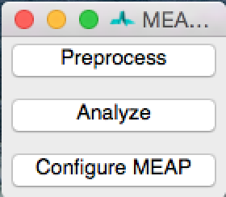

Select **Preprocess**. This will open a window that looks like this:

.. figure:: _static/preproc_launch1.png
   :scale: 80 %
   :alt: preprocessing launch screen
   :align: center 

Click on the folder in the upper right corner to navigate to your input file. Information 
from this spreadsheet will be called and a window will appear that contains all of your files 
to be scored and also serves as the primary user interface. 

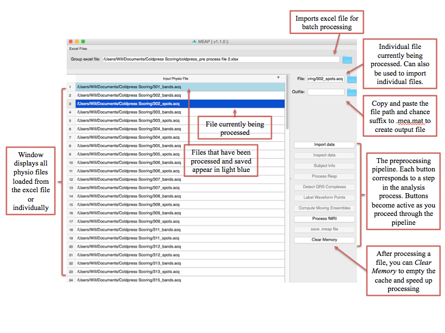

Files to be processed appear in white. Once you finish the preprocessing pipeline and 
save as ``.mea.mat`` file, the row will turn light blue. The file currently being processed 
appears in dark blue. To import files individually, right click within the "Input Physio file" 
portion of the window and select **Add New Item**. Then click within the blank line that 
appears and then navigate to the file you wish to score using the blue folder icon to the 
right of the *File* field. 

Now select the first file you would like to process. Then click on the **Import data** 
button at the right of the screen to begin preprocessing.

.. figure:: _static/import_data.png
   :scale: 60 %
   :alt: import data
   :align: center

Once your Aqcknowledge file is imported you'll need to let MEAP know which 
channel contains each data source. If loading from a mea.mat file, the channels have
already been stored. For Acqknowledge files, specify the data contained 
within each channel using this GUI: 

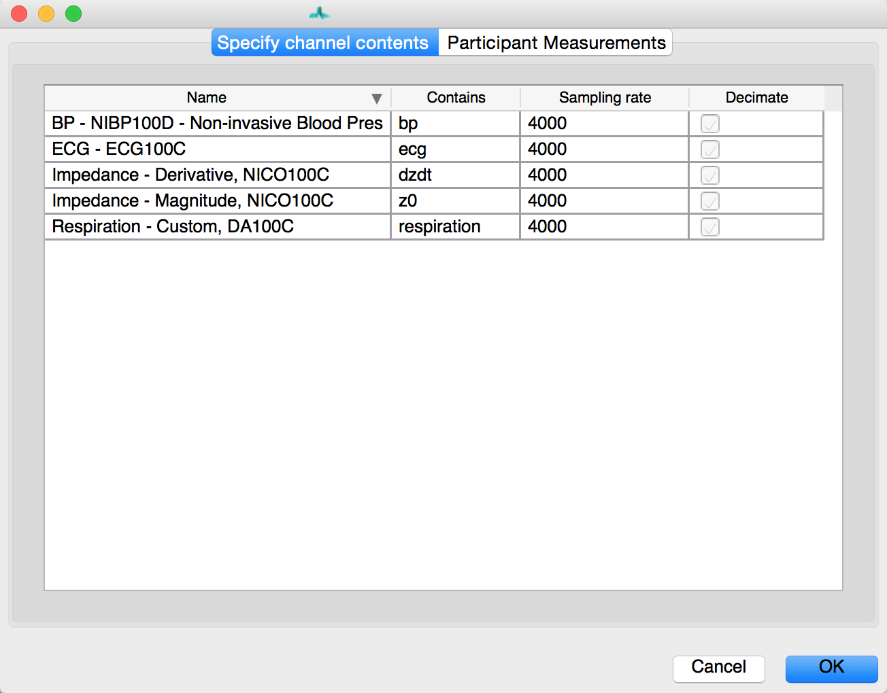

The channel names from your data file appear on the left. Match these with the data types
specified in the dropdown menus on the right.  If blood pressure data was collected using 
a wireless blood pressure system or other system that generates separate channels for 
diastolic and systolic blood pressure, map each of these accordingly; systolic and diastolic 
are both options in the drop down menu. Any remaining channels that you do not wish to 
import data from should be set to *None*. 

Regardless, of the number of channels that appear in the ``.acq`` file and their names, you 
should have the following channels mapped: 
	
	1. **ECG** - Electrocardiogram data 
	2. **z0** - Magnitude of impedance 
	3. **bp** - Blood pressure (or systolic and diastolic; optional) 
	4. **dzdt** - First derivative of impedance magnitude.
	5. **respiration**- breath data (optional)
	6. **doppler** - Cardiac doppler radar signal (optional)
	

This window also contains a tab in which you can specify or correct the participant's
measurements. The inter-electrode distances are imported directly from your input file as is
any other information you specified including height, weight, respiration circumference, 
and whether data was collected during Magnetic Resonance Imaging (MRI). This latter 
specification in critical as MEAP utilizes a customized point-marking algorithm for data
collected within the scanner. 

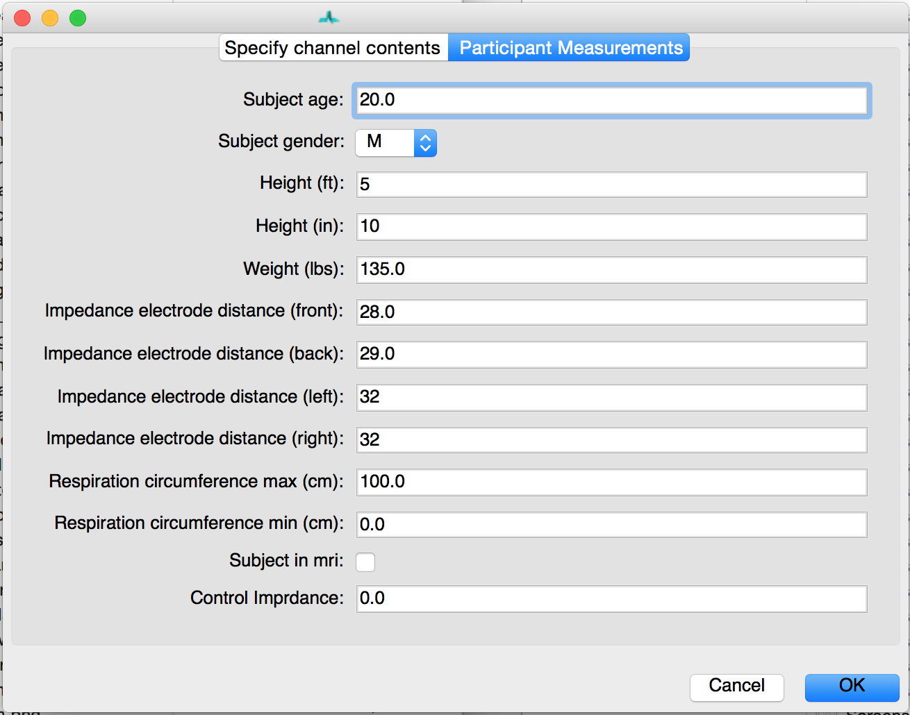

When importing files individually you MUST manually enter the participant measurements here.
These values can also be edited after the fact by clicking on the **Subject Info** button. 

For more information on these parameters and how to specify them in your input file 
see :ref:`participant-parameters`.

   
Step 3: Check the Quality of Your Waveforms
~~~~~~~~~~~~~~~~~~~~~~~~~~~~~~~~~~~~~~~~~~~~
Now that you have specified the type of data contained within each channel and updated 
participant measurements as desired, click on the **Inspect data** button at the bottom 
of the GUI.

.. figure:: _static/inspect_data.png
   :scale: 80 %
   :alt: inspect data button
   :align: center

MEAP will load and display the data in a GUI like this:

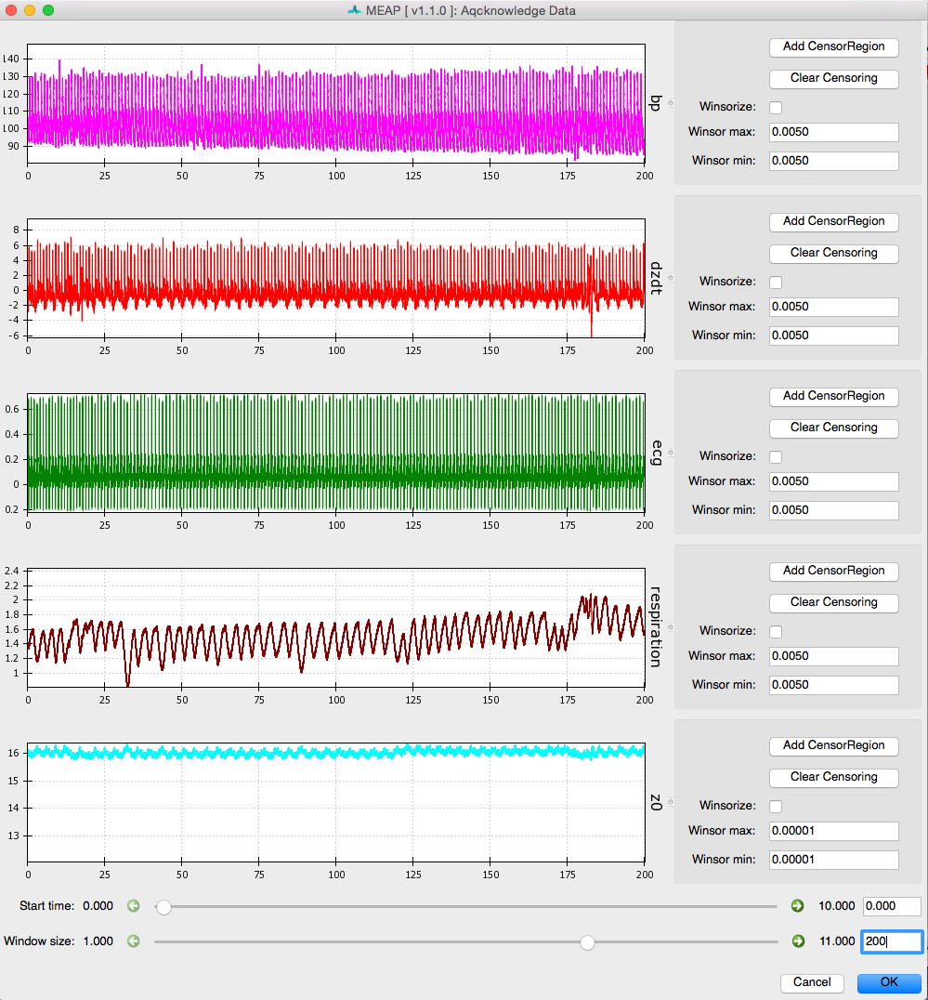

This feature is designed to allow the user to check the quality of the data, remove outliers, 
and flag any segments of data that contain noise or artifacts or that the researcher would 
like to exclude from analyses for whatever reason. Flagged sections will then be removed from 
all future analysis steps including point marking and ensemble or moving ensemble averaging. 

.. Warning:: It is critical that all data included in calculations be as clean as possible. 
	Attempting to analyze data with significant artifacts will not yield interpretable values. 

**Windsorizing: Removing Extreme Outliers** 

The first thing to do when inspecting your data is to Windsorize outliers, if necessary. 
For example, the Z0 signal may drop to zero at the beginning or end of a file leading the wave 
form to appear small and uncentered in the window, as shown in image above. Such extreme 
outliers can be removed by selecting the **Windsorize** button next to the waveform that 
contains outliers and setting the maximum and minimum cutoffs for outliers. For example, 
setting both the max and min values to .005 means that you are pulling in the top and bottom 
0.5% of the data to just inside that cutoff. You may need to adjust one or both of these 
parameters depending on the outliers contained within your data. Ideally, you want to set
these cutoffs so that you are removing only extreme outliers and not any meaningful data. 
If Windsorizing leads to your waveforms appearing truncated, set lower cutoff values. If 
you don't see your window update, check and uncheck the **Windsorize** button for that 
waveform. 

Post-windsorizing your Z0 data should look like this: 

.. figure:: _static/wind_Z0.png
   :scale: 70 %
   :alt: Windsorized Z0
   :align: center

**Censor Regions: Removing Noise & Aritfacts**

Next, use the *Window size* slider at the bottom of the screen to select a widow size that 
optimizes viewing your data. We recommend a window size of between 20 and 60 seconds to 
allow the user to clearly visualize each waveform and inspect it for anomalies. 

Like so:

.. figure:: _static/zoom.png
   :scale: 70 %
   :alt: acq data source- zoom
   :align: center

Using the *Start time* slider you can scroll through the length of your data file. 
You'll notice that if you start at time 0 and move the slider to the far right, you
do NOT reach the end of the file (unless it is very short). To do this you must use the 
green arrows to increase the sensitivity of the slider by a factor of 10 each time. 
Alternatively, you can jump to a specific time point by entering it into the box to the right.

As you scroll through, look for any sections where the waveform deviates significantly 
from it's canonical shape. 

Artifacts can look like this, where the signal drops off or shoots up beyond expected values:

 .. figure:: _static/zoom_artifact.png
   :scale: 90 %
   :alt: censor regions 1
   :align: center

Artifacts can also look like this, where the signal deviates from its canonical shape, although
values do not appear out of bounds:

 .. figure:: _static/zoom_artifact2.png
   :scale: 45 %
   :alt: censor regions 2
   :align: center

Artifacts are most likely to occur in the dz/dt signal, but may occur in any of the data streams.

.. Note:: For more info on what wave forms should look like, see :ref:`physiological data`

Whenever you come across an area of noise like this, you will want to remove it from 
analyses by censoring it out. This is accomplished using the *Censor* buttons to the right 
of each signal. Select the button that matches the waveform you wish to edit and use
your curser to highlight the region you would like to exclude. If you would like to remove
multiple regions, simply click on the *Censor dz/dt* again and select another region. To 
censor regions on additional waveforms, simply select the relevant *Censor* button and 
highlight the region.

 .. figure:: _static/censor.png
   :scale: 90 %
   :alt: censor regions 1
   :align: center
   
Do this as necessary for each waveform. If a region is censored out on one waveform (the 
*dz/dt* wave, for example) this same time interval is censored out of all other waves as 
well. Therefore, if artifacts occur in multiple waveforms simultaneously, it is not necessary 
to censor them separately on each waveform (as in the image above). This means that if one 
signal is bad throughout it is best not to edit this out, but to leave it and remove calculated 
values later in the analysis pipeline. For example, if BP data is bad throughout this 
approach will allow you to still analyze the impedance and ECG data. Without good ECG data, 
however, MEAP cannot calculate and align cardiac cycles and analysis will not be possible. 

.. Note:: This editing feature can also be employed to remove epochs of data that the 
   researcher does not wish to include in analyses. 

Once you are satisfied with the regions to be removed, select *OK*. 

This is a good time to save your work. To do so, copy the *File* path and paste it into 
the *Outfile* field and change the file type from ``.acq`` to ``.mea.mat``, then click
**Save .meap file**. You could also provide any file name as long as it ends with .mea.mat.

Step 4: Processing Respiration Data
~~~~~~~~~~~~~~~~~~~~~~~~~~~~~~~~~~~~~

If you collected respiration data as part of your study MEAP can calculate the number of
breaths. MEAP can also calculate breath rate from the ICG data. Additionally, by processing 
respiration in this way the user can remove the low frequency fluctuation in ICG signals 
due to respiration rather than changes in blood flow. Because the torso expands with each 
inhalation, the respiration cycle impacts impedance data in ways that may or may not be of 
interest to the researcher. 

Select **Process Resp**: 

.. figure:: _static/process_resp.png
   :scale: 80 %
   :alt: process respiration
   :align: center

This will load a window like the one below which shows dz/dt, Z0, and respiration waveforms.

.. figure:: _static/resp.png
   :scale: 50 %
   :alt: respiration 1
   :align: center

Click the **Process Respiration** button at the bottom of the screen and MEAP will use either
the measured respiration signal or low frequency components of the ICG wave to determine 
respiration rate and remove its influence on the dz/dt and Z0 waveforms. The blue lines 
represent raw data and green represents data with variation due to respiration removed. Black 
dots mark inhalation and exhalation. 

.. figure:: _static/resp_1.png
   :scale: 50 %
   :alt: respiration 1
   :align: center
   
Sliders can be used to change the size and start point of the viewing window just like at 
the *Inspect Data* step.

Processed respiration using measured respiration signal:

.. figure:: _static/resp_2.png
   :scale: 50 %
   :alt: respiration 2
   :align: center

Processed respiration using dz/dt waveform:

.. figure:: _static/resp_3.png
   :scale: 50 %
   :alt: respiration 3
   :align: center 

After respiration has been processed, simply close the window and proceed to the next step.

Respiration correction is a very useful preprocessing step. Consider the Kubicek equation
for calculating stroke volume. The Z0 term is directly included, which means that
respiration-related signals will be incorporated in stroke volume and impact all measurements
that use stroke volume. These include cardiac output and TPR. One remedy to respiration 
artifact is ensemble averaging. However, unless the same portions of the respiratory cycle
are included in each time window, respiration-driven changes will only add to your model's
noise term. 

Step 5: Detecting R-Peaks 
~~~~~~~~~~~~~~~~~~~~~~~~~~

Now that you have loaded your data, checked its quality, and removed areas of artifact, 
the next step is to detect each heartbeat. Click on the **Detect QRS Complexes** button.

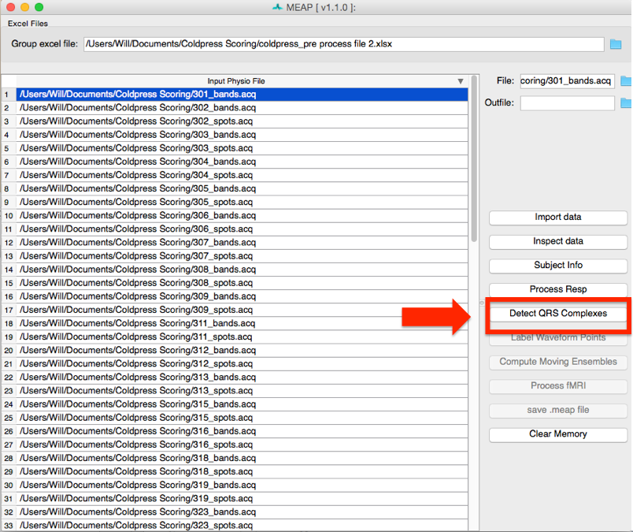

MEAP automatically detects each R-peak using a modified Pan-Tomkins algorithm (for more 
information on the Pan-Tompkins method see :ref:`beat-detector`). There are other options
for QRS detection that work better for data collected in an MRI scanner. However, all methods
share the same basic editing tools.

Each R peak on the ECG wave is marked with a black square.

.. figure::  _static/qrs_all.png
   :scale: 80%
   :alt: beat detector 1
   :align: center

Again, the sliders below the displayed data allow the user to scroll through the 
file and change the window size.

.. figure::  _static/qrs_zoom.png
   :scale: 80%
   :alt: no R-peaks in censored regions
   :align: center

If you censored any ECG data in the previous step, the R-peaks that fall 
within this region will be ignored. R-peaks in regions censored due to noise in other signals will 
still be detected. 

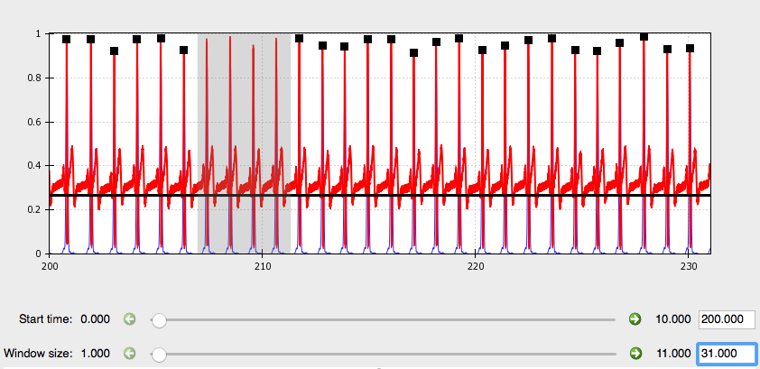

The bottom right corner of this window displays a topographical image of all detected R-peaks.
This image displays all R-peaks aligned with one another and viewed from above. The peak of
each waveform appears in red while troughs appear in blue. This image allows the user to 
easily visualize the data and whether R-peaks have been correctly detected. When R-peaks are
incorrectly marked, this image will apear jumbled rather than stripes of color corresponding
to the topography of the canonical ECG waveform. 

In most cases the default settings will allow for accurate detection of each R-peak. 
Depending on the noisiness of the data and/or idiosyncratic differences in waveform shape, 
however, the user may need to adjust the default settings. Adjustments are usually required
only where a participant has a very high t-wave or where there is significant respiration 
or other artifact. 

The beat detector GUI allows the user to edit the parameters of a modified Pan Tomkins 
QRS detector in order to more accurately mark the R-peaks in cases such as those just
described. The most likely change you will need to make is to change the **Pt adjust**
setting to be slightly higher or lower. If it is falsely detecting t-waves as peaks, 
adjust it up, if true R-peaks are being missed, adjust it down. Usually a change of .05 
to .1 does the trick. Don't forget if you sensored regions previously, R-peaks that fall
within these regions will not be marked. 

If there is an R-peak that is incorrectly marked due to noise that you missed in the 
previous step, you can remove this point now. Hold down the right-click button and mouse 
over the R-peaks you wish to delete, then right click again within that region to remove 
those point markings. 

Simply click within the portion of the window
displaying each R-peak. The squares marking these will change from black to yellow. Use the
mouse to highlight the are surrounding any points you want to remove (just like in the *edit
data* step above.

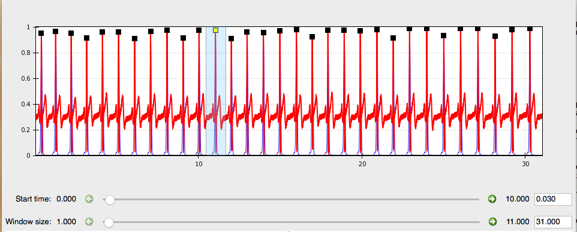

You can also mark individual R-peaks as needed by highlighting the peak you wish using the 
left-click button on your mouse. 
	
.. Note:: For more information on the Pan-Tompkins method and parameter options, 
	see the :ref:`beat-detector` section of this documentation. 

Step 5a: Finding QRS complexes in the MRI
~~~~~~~~~~~~~~~~~~~~~~~~~~~~~~~~~~~~~~~~~~

The ECG signal is much noisier in the MRI scanning environment. This is due to a number
of factors, including magnetohydrodynamics (the effect of the magnetic field on blood)
and RF noise from the scanner. One option is to use a second signal that captures some
aspect of the cardiac cycle that is less impacted by scanner noise, such as dZ/dt or a 
pulse oximiter. We call this Multi Signal Detection. To enable Multi Signal Detection,
check this box:

.. figure::  _static/enable_multisignal.png
   :scale: 80%
   :alt: Enable multisignal detection
   :align: center

Select which signal you want to use as the secondary cardiac cycle indicator

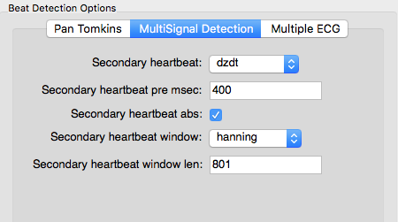

and indicate how to filter this signal. Ideally there should be a single local
maximum corresponding to each heart beat. The secondary signal gets low-pass
filtered according to these options and peaks are identified. Then a search
window is built around each peak and an attempt is made to identify a QRS
complex within each search window:

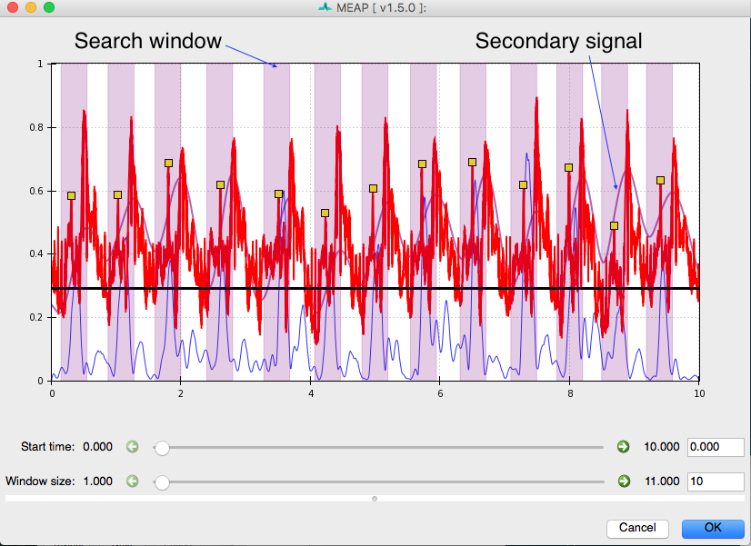

The search windows are light purple and highlight the area around peaks in
the secondary signal. In this instance dZdt is the secondary signal, so the 
window is placed in front of its peaks (because the QRS precedes the peak
of dZ/dt). QRS complexes identified in this way can still be edited using
the same clicking tools described above.

Step 6: Marking Custom Points
~~~~~~~~~~~~~~~~~~~~~~~~~~~~~~

The next step is to provide MEAP with information about where to look for inflection points 
of interest in this subject's file. 

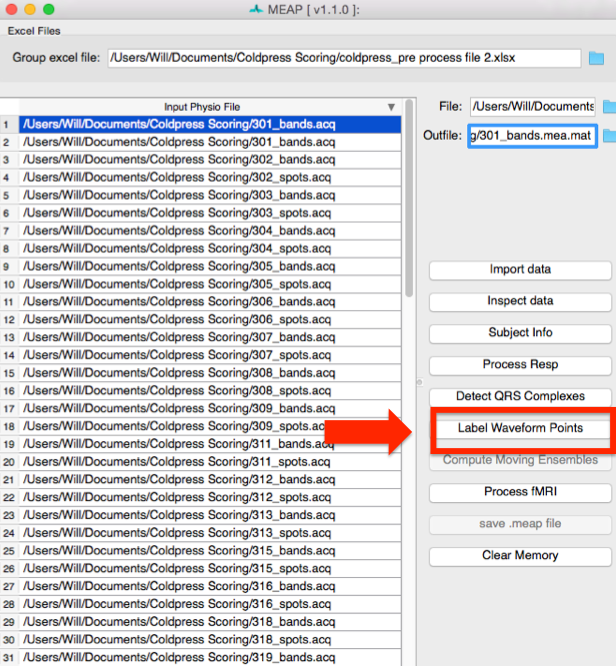

Clicking the **Label Waveform Points** button brings up a window displaying an ensemble 
averaged waveform for the entire data file. The **ICG Editor** tab shows the dz/dt wave 
produced by ensemble averaging the entire file (excluding any censored regions). The full 
dz/dt signal as well as it's first and second derivatives are displayed along side a zoomed-in
view of the R to C portion of the dz/dt wave. These features are designed to assist the user
in selecting the B-point on the ensemble averaged waveform. By hovering over any of these images, the 
dashed line indicating the b-point crossing can be adjusted to the desired position. 

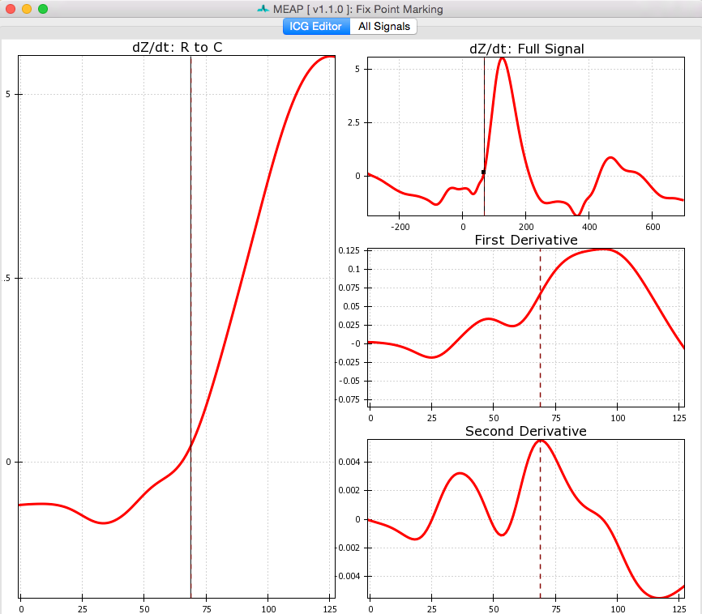

The **All Signals** tab displays the ensemble averaged waveforms for all physiological signals 
(except respiration) across the entire ``.acq`` file.  Using a classifier derived from previous data, 
MEAP has attempted to mark each of the relevant inflection points on this waveform. It is the job 
of the user to examine these points, determine whether each is marked in the correct location, 
and to adjust their placement where necessary. Point markings can be adjusted by simply 
clicking on each and dragging it to the correct location. Moving the B-point in either of the 
two tabs adjusts its placement in the other. Correct point markings should look like this:

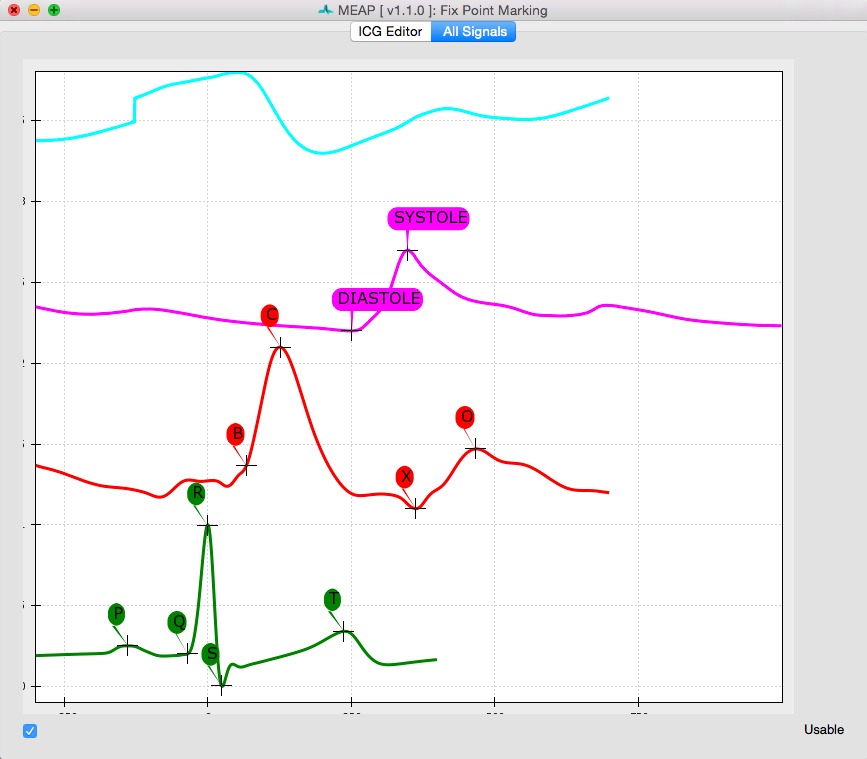

.. warning:: If you cannot find where one of the points is marked, it may be hidden beneath
	one of the other points. Occasionally with messy data one point will be placed on top of 
	one another such that one is not visible. 
   	  
Once each point is marked on the ensemble averages, MEAP will use these values to update
it's classifier and determine where to look for and mark the corresponding points at each 
individual ensemble average or beat (depending on type of analysis). 
   
When you are satisfied with the placement of each point on the heuristic ensemble average,
simply close the window and proceed to the next step.

Step 7: Compute Moving Ensembles
~~~~~~~~~~~~~~~~~~~~~~~~~~~~~~~~~

The next step is to compute moving ensemble averages. 

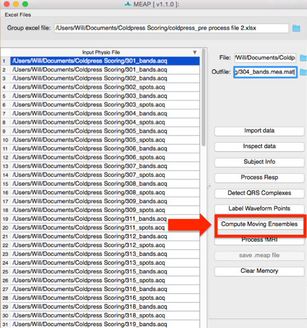

It takes some processing power for MEAP to use its classifier to compute the moving ensembles and 
mark relevant points on each ensembled beat. While it's processing you will see a window like this:

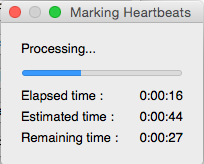

When it's done you will see a window like this:

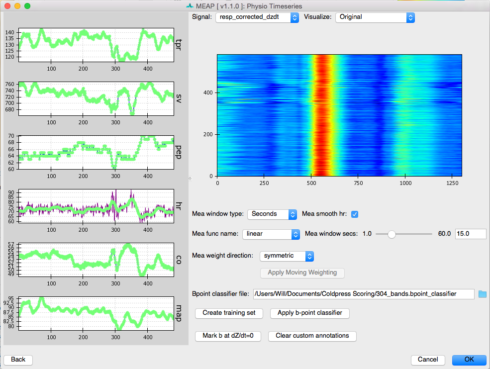

Along the left panel are displayed each of the main physiological indices MEAP computes plotted as 
a time series. In green are the values as calculated using the moving ensemble average. 
The purple trace indicates what these values would be using just the raw data. 

The right panel displays a topographical map of the raw dz/dt data corrected for respiration.
Changing the setting for **Signal** allows the user to view each of the different data streams 
in this manner. The **Visualize** option allows the user to select to view the raw or *Original*
data, the data after the moving ensemble average is applied, or the residuals of this moving 
ensemble analysis.

Moving Ensembled:

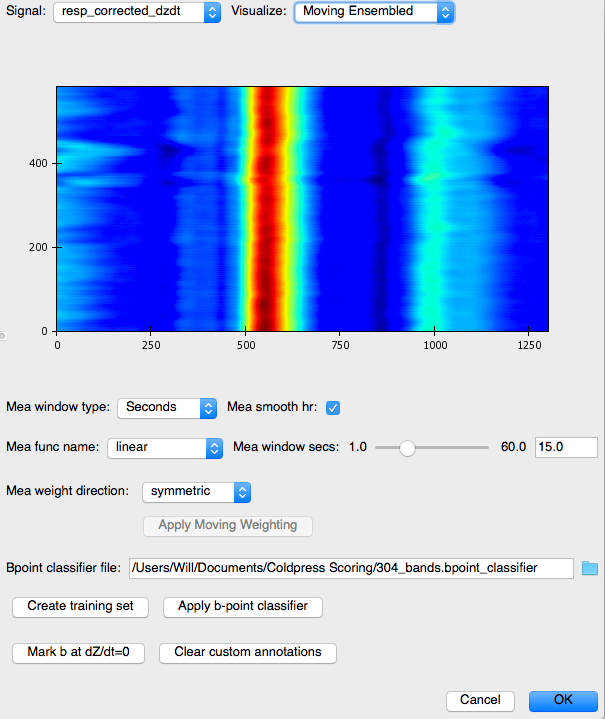

Note, how much cleaner the moving ensemble is than the raw data. 

Residuals: 

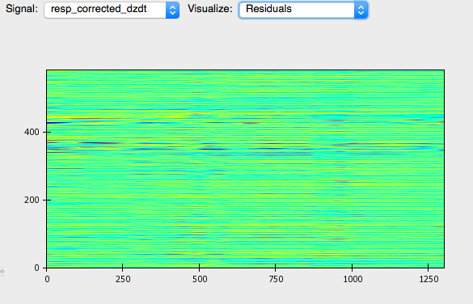

Ideally, residuals will be random, producing no clear pattern in the image. 

Identifying B-Points
~~~~~~~~~~~~~~~~~~~~~

The most time-consuming and error-prone part of ICG analysis is identifying 
B-Points. This is a critical time for determining systolic intervals and
therefore great care should be taken when marking this point. 

MEAP provides two methods for automating this process. The first, an AdaBoost-based
B-Point classifier was described in our 2018 Psychophysiology paper. This approach
works very well, but requires manually labeling hundreds of points per recording
to train the classifier. The second is unpublished, but relies on time series registration
to "warp" B-points from a set of ICG shape templates. This method is much faster and 
has nice theoretical properties. 

**Training the B-Point Classifier**

B-points are notoriously difficult to mark as they are neither a maximum or a minimum. Thus, 
although we have provided a prior to MEAP to tell it where to look for the b-point, we want 
to provide MEAP with more data with which to train its b-point classifier. To do this 
click on: **Create Training Set**. With this button press, MEAP will randomly select a 
number of beats from the file (the default is 100 beats) for the user to hand mark. 

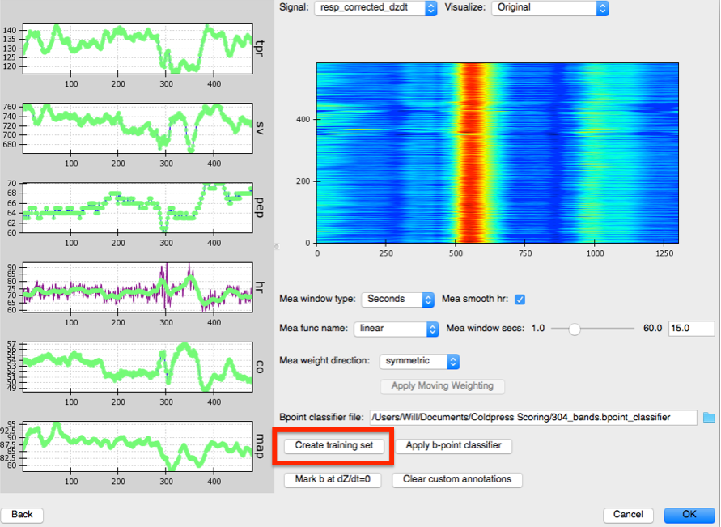

This window looks almost exactly like the one we used to mark the ensembled average points
except that this time a series of randomly selected moving ensembled heart beats is listed 
in the left most panel. Clicking on each brings up that heart beat. Once you've hand labeled it, 
the box in that column will be checked. The top image in the top right panel displays the 
results of a principle components analysis of all marked inflection points. This plot 
allows the user to easily visualize the spread of the data and identify potential outliers. 
The bottom right panel plots the values for *LVET*, *PEP*, or *SV*, depending on which
the user selects. The *N samples* field in the top left corner of the window allows the user 
to specify the number of randomly selected beats to be hand marked and employed by the classifier.
If there are any beats that you wish not to include in analyses, due to noise or whatever reason, 
unselect the *Usable* box at the bottom of the window. This will remove data from this beat 
from all further analyses.  

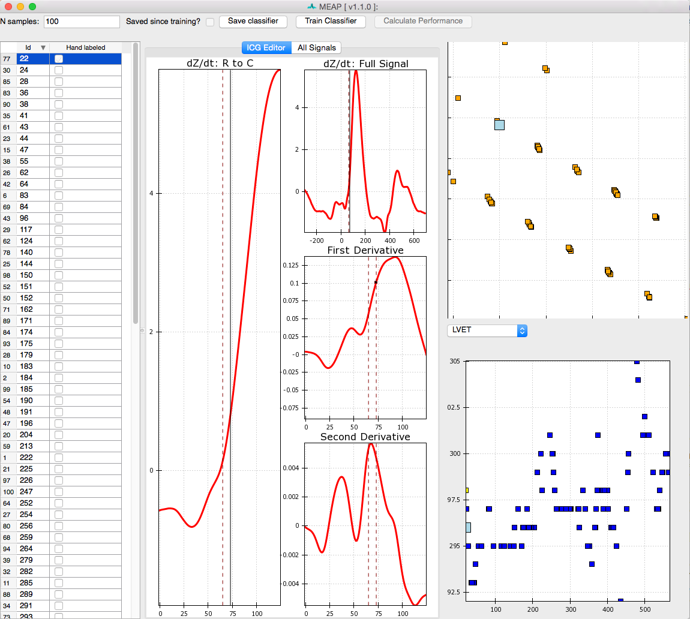

As in the *Marking Custom Points* stage, the user can toggle between the **ICG Editor** and
**All Signals** tabs to view just the ICG signal, or all data streams together. The other 
aspects of this window remain the same. 

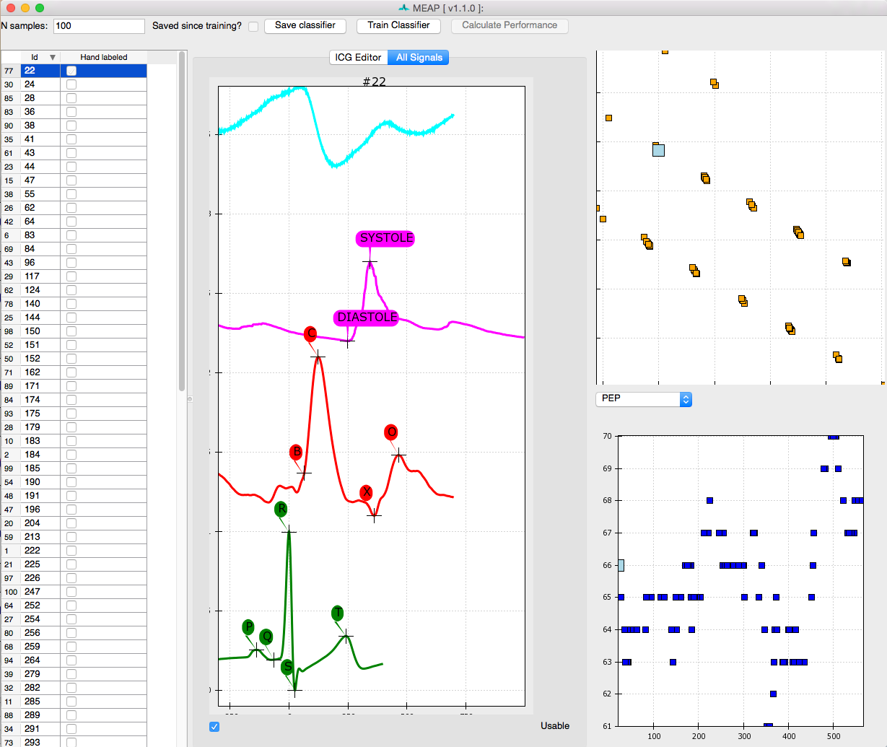

Once you are satisfied with all marked points, select **Train Classifier**. This may take 
a moment or two to process. Once complete, select **Save Classifier**. You can then close
out of this window.

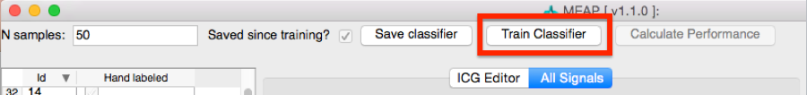

Then return to the *Physio Timeseries* Window. Note that the points that we hand-marked 
now appear in purple. The reason for MAP and TPR values dropping to zero is that blood 
pressure data was censored at that point. Select **Apply b-point classifier**. 

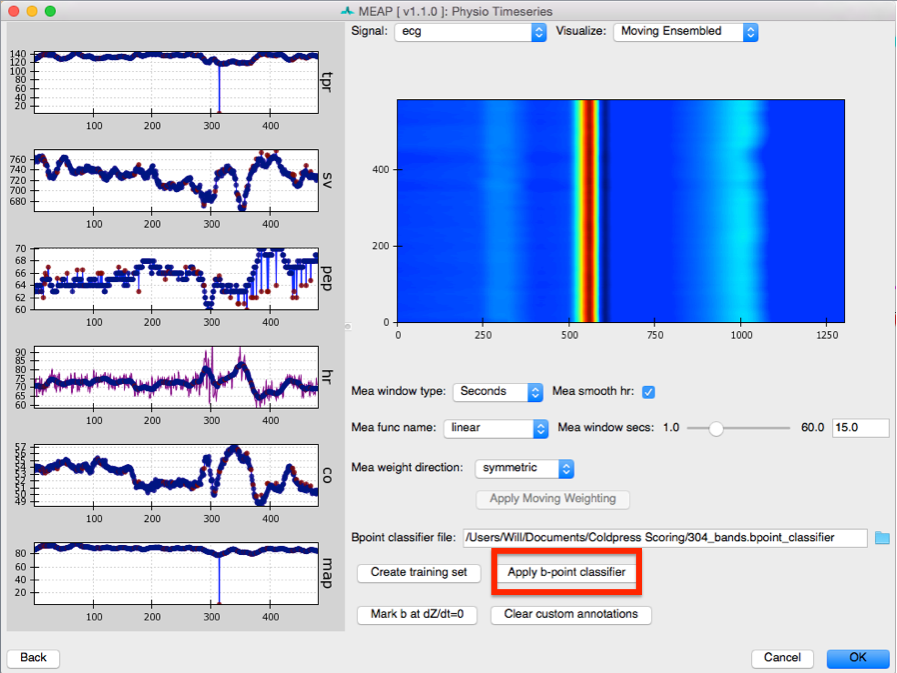
   
**Using SRVF-based dZ/dt registration**

Starting at MEAP version 1.5 you can use SRVF-based timeseries registration. You can
think of this method as similar to diffeomorphic spatial normalization used in 
neuroimaging group studies. Instead of manually identifying a specific region in each
brain, you can warp all the brains to a template, draw the region on the template, then
inverse warp the region into each individual brain. Here we're doing the same thing with
dZ/dt waveforms. 

You can access this tool by clicking **Register dZ/dt** from the pipeline window. This process
involves 4 steps. First, a single template is created from a randomly-selected subset of 
all heartbeats. Next, all heartbeats are registered to this initial template. Third, the
warps to the initial template are used to cluster individual heartbeats into similarly-shaped
subsets. A template for each of these shape "modes" is created. Finally, the user hand-marks
B-Points on each mode template and these are inverse-warped to each heartbeat.

To create an initial shape template, or Karcher Mean, of your dZ/dt signals you will use
the widgets in the left half of this screen:
   
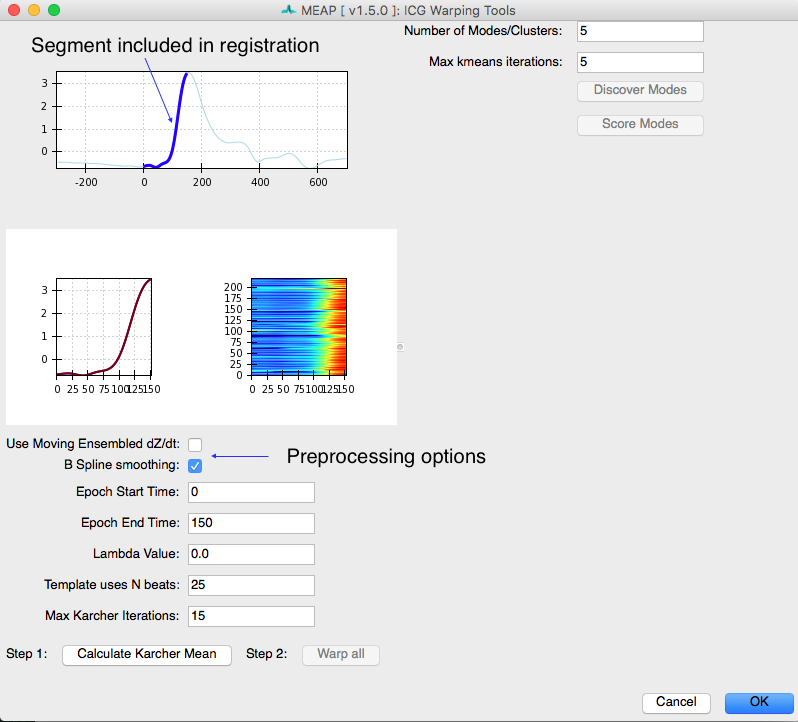

It is important to decide whether you want to use moving ensembled dZ/dt signals or
the original raw signals. Original signals will vary in shape depending on the 
part of the respiratory cycle in which they occurred and will also have pronounced
pre-load and after-load effects on the locations of the B-Points. Also, data with 
abrupt spikes can fail to produce a meaningful Karcher Mean. If your data has spikes,
we recommend filtering it in AcqKnowledge and/or using the B-Spline smoothing option 
here. 

Only a portion of the dZ/dt waveform is used for this procedure. Using the entire waveform
causes the template-building process to be incredibly time-consuming and also produces
poor results during clustering. You select the portion of the dZ/dt signal that will
be included in this analysis in the Epoch Start Time and Epoch End Time fields. Lambda
controls how much the time series are allowed to deform. The number of beats used and
the maximum number of template-building iterations can be specified here. Once you
are satisfied, click "Calculate Karcher Mean".

After a few minutes the plots will update and the "Warp All" button will be enabled.
   
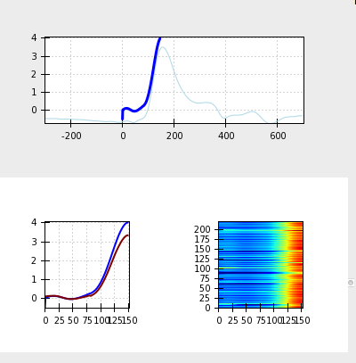
   
The updated plots will look something like the above. You will notice that the Karcher
Mean (dark blue line) has higher amplitude than the global ensemble average (light
blue line) and contains sharper features.  These are all benefits of using an elastic
time series approach. Click "Warp All" and all of your heartbeats will be registered
to this initial Karcher Mean. The bottom two plots will show the individual dZ/dt signal
in red after it is aligned to the Karcher Mean in blue. The image plot on the right
is a heat map of the aligned dZ/dt signals. 

Once all beats have been aligned to the initial Karcher Mean, you can cluster heart
beats based on the similarity of their warps using the widgets in the right panel.
We use the distance metrics and general procedure described in Kurtek 2017 to cluster
heart beats. Choose the number of clusters and the maximum number of K-means iterations.
Once satisfied with your choices, click "Detect Modes". This will take a long time to run.
If you are using MacOS, it will take much longer than any other operating system. Once 
completed, the "Score Modes" button will be enabled.

Clicking the "Score Modes" button will open an editor like the one below:

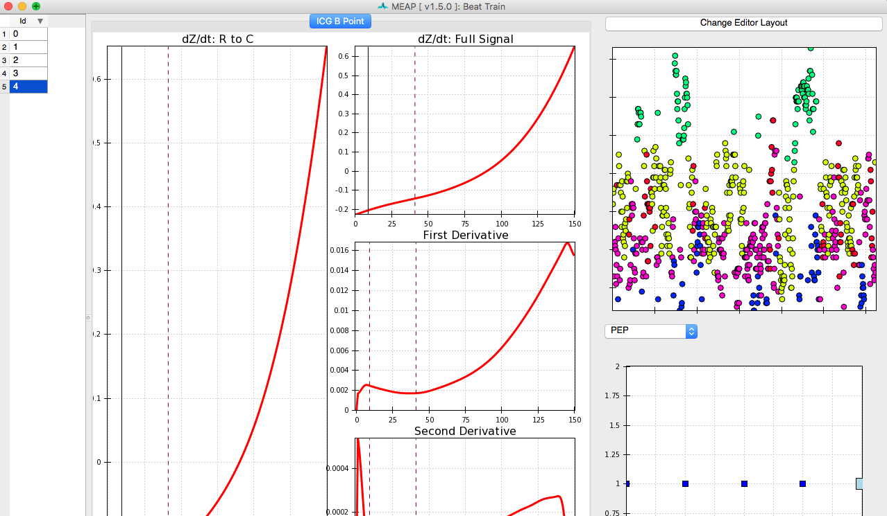

There will be one beat listed in the left panel for each mode you requested. Clicking
on that beat will show what that cluster's template dZ/dt looks like. The B-Point times
are plotted in the upper-right panel. By editing the B-Points, the corresponding time in
each original beat will be updated. Manually identify te B-Point on each Mode and the inverse
warp to the original beats will be used to identify the corresponding point on the
original waveform.

Once you're satisfied, you can visit the "Compute Moving Ensembles" window again to edit
individual B-Point placements.

Step 8: Process fMRI
~~~~~~~~~~~~~~~~~~~~~~~~~~~~~~~~~~~~~~~~~~~~~

This feature not yet functional, but coming soon. 

Step 9: Save Your Preprocessed File (Again!)
~~~~~~~~~~~~~~~~~~~~~~~~~~~~~~~~~~~~~~~~~~~~~

Save your Work! If you have not done so already, copy the *File* path and paste it into 
the *Outfile* field and change the file type from ``.acq`` to ``.mea.mat``, then click
**Save .meap file**. 

The file you just preprocessed should now be highlighted in blue. Proceed to the next file
and repeat these steps until you have scored the data for all of your subjects. 

To improve processing speed click the **Clear Memory** button to clear the memory cache 
before proceeding to the next file. 

PART II: Calculating Ensemble and Moving Ensemble Averages
============================================================

Step 1: Create a Design Spread Sheet
~~~~~~~~~~~~~~~~~~~~~~~~~~~~~~~~~~~~~~~~

This should specify your subjects, your experimental design, and the path to the ``mea.mat``
files that you preprocessed:

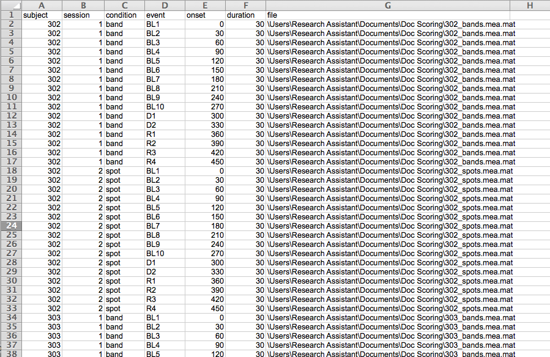
   
Exactly how this file should be set up will depend on the length of the ensemble average 
window you are using and on other specifics of your study design. 

This same file is also where your data will ultimately be printed. Thus it serves as both 
the input and output file for this stage of the scoring process. 

Step 2: Analysis
~~~~~~~~~~~~~~~~~~~~~~~~~~~~~~~~~~~~~~

For step 2, select **Analyze** on the MEAP launch window. 

**Ensemble Averaging**

The first step is to load your prepared design file. The analyze interface will then look like this:

.. figure::  _static/analyze_interface1.png
   :scale: 60%
   :alt: design spreadsheet
   :align: center

Until you click **Run** all values for indices will be zero and nothing will be plotted in 
the windows on the right. After selecting run, the interface will look something like this:

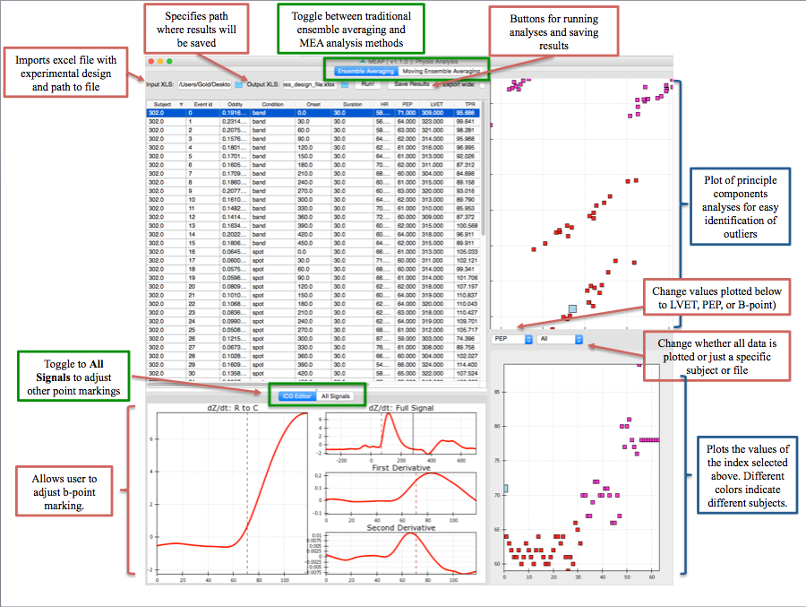
   
The Ensemble Average window allows the user to visualize each ensemble average (duration 
specified in your excel file) as well as the values for key indices (B-point, PEP, LVET)
for all subjects, for a specific subject only, or for a specific data file only. In the 
top right corner is an ICA plot which takes all of the features of the ensemble 
averages into account and then plots them in two dimensions based on their covariance. 

Using the column headers you can sort by subject, event, or by "oddity index" which reflects
that EAs distance from the center of the ICA plot. This allows you to quickly identify
problematic EAs and adjust point markings as necessary. 

.. figure::  _static/sort_by_oddity.png
   :scale: 60%
   :alt: Oddity
   :align: center

To view all point markings (not just the B-points) toggle the bottom window to **All Signals**.
There you can adjust the placement of any of the inflection points. If the data for a specific 
EA is too noisy or you decide you don't want to include it in analyses for whatever reason 
simply uncheck the *Usable* button at the bottom of this window and that EA will be removed 
from the dataset. 

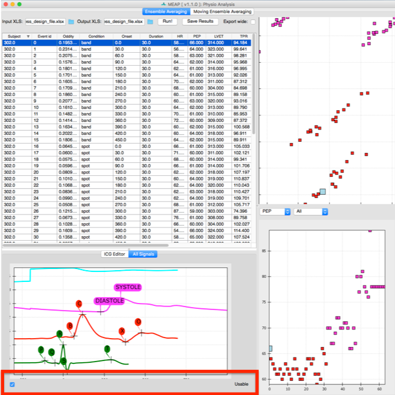
   
Using these point markings MEAP calculates the following cardiovascular indices:

	1. **Total Peripheral Resistance** (TPR)
	2. **Cardiac Output** (CO)
	3. **Stroke Volume** (SV)
	4. **Pre-Ejection Period** (PEP)
	5. **Mean Arterial Pressure** (MAP)
	6. **Heart Rate** (HR)
	7. **Heart Rate Variability** (HRV) 
	
All of these values for each EA will be exported to your excel output file:

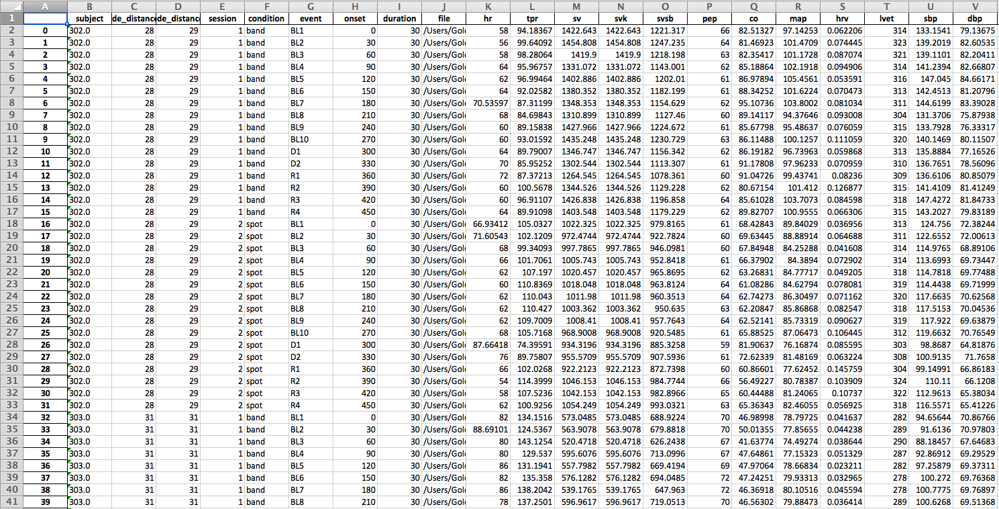
   

Step 3: Save Your Work!!
~~~~~~~~~~~~~~~~~~~~~~~~~~~~~~~~~~~~~~

Click the "Save Results" button at the top of the GUI to save your work. 
Do this frequently as you are working. All of your custom point markings will be saved and 
you can reload and return to them by using the newly created output spreadsheet as input. 

PART III: Analyzing your Scored Data
============================================================

At this point you have completed the data scoring process. You now have a ``.csv`` file 
with values for each cardiovascular index for each ensemble average. MEAP calculates 
a slope and an intercept for each EA.  

If you want to use the time series data from the moving ensemble averages computed during 
preprocessing, those can be pulled from the .mea.mat file using R or another statistical 
package of your choice. 
	
You are now ready to move this data into whatever statistical software you prefer for analyses.
Depending on what type of analyses you wish to conduct you may need to reformat the data. 
As it is, the data appears in *long format* with multiple rows of data for each subject. 
Some analyses require *wide format* where each subject has only one row of data but multiple
variables for each cardiovascular index reflecting the values for each ensemble average. 

Again, depending on your study design and the analyses you wish to conduct you may want to
create reactivity values that reflect values for each index minus baseline values (E.g. 
CO_min1 - CO_BL). All analyses and data transformations are done outside of MEAP in your
statistical software of choice. You should also use this software to check for outliers
or any other issues with your data. 