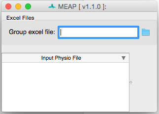
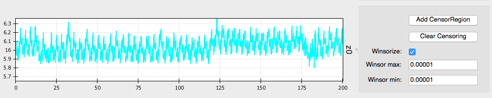
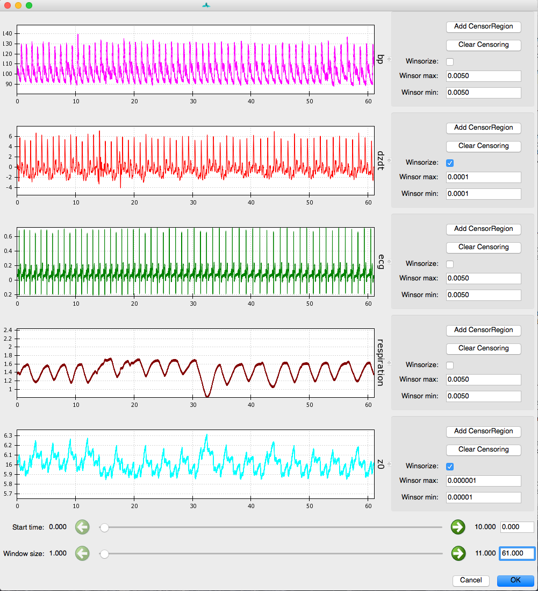
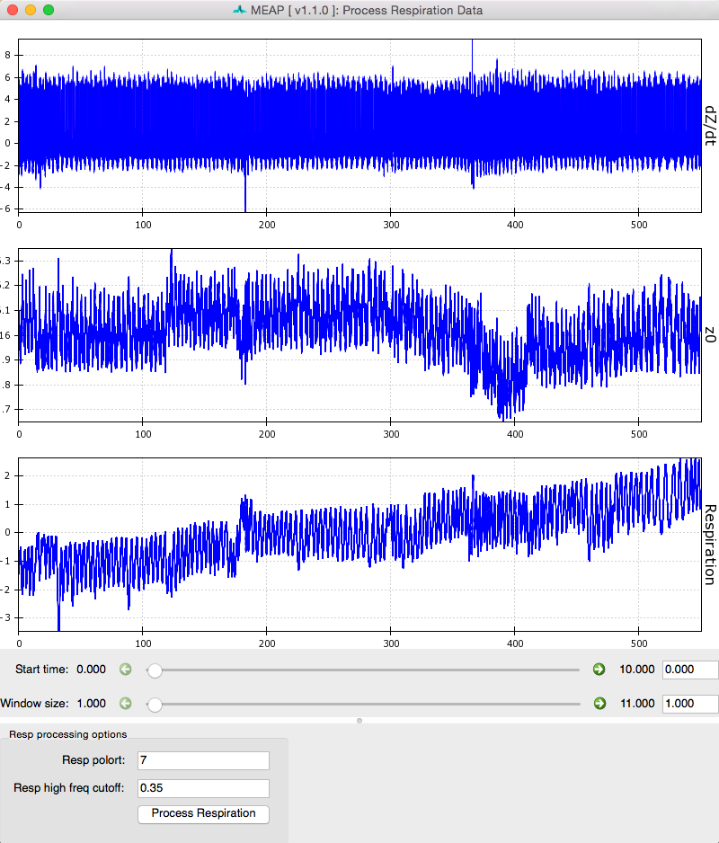
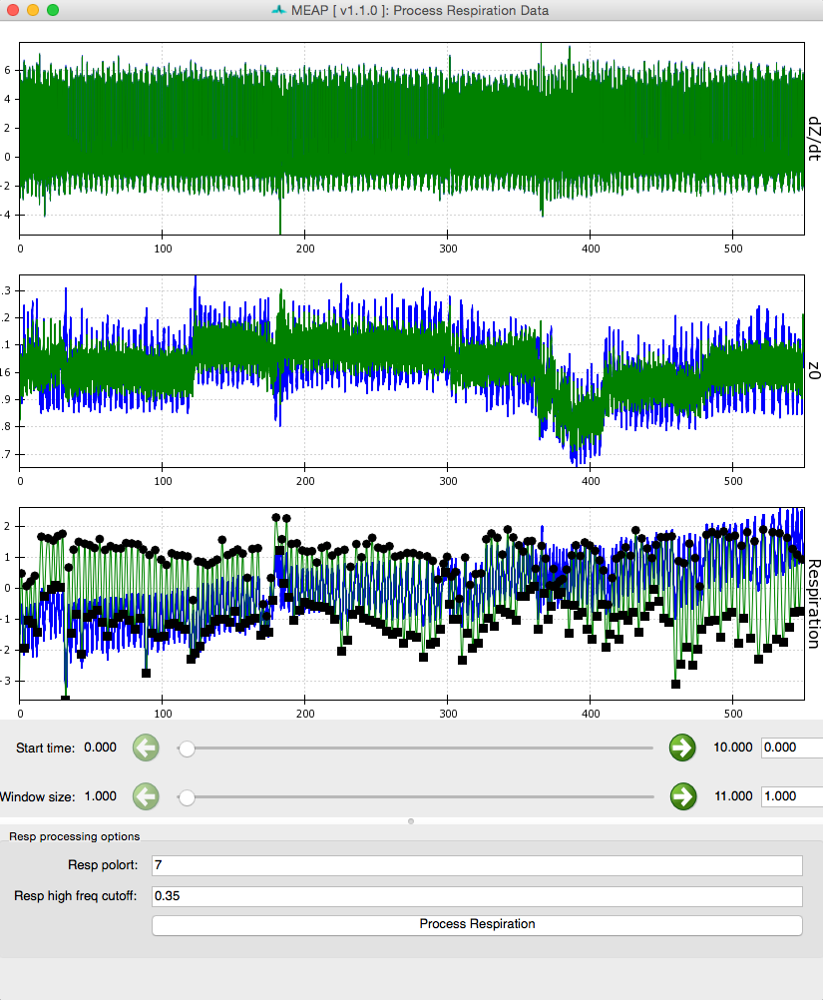
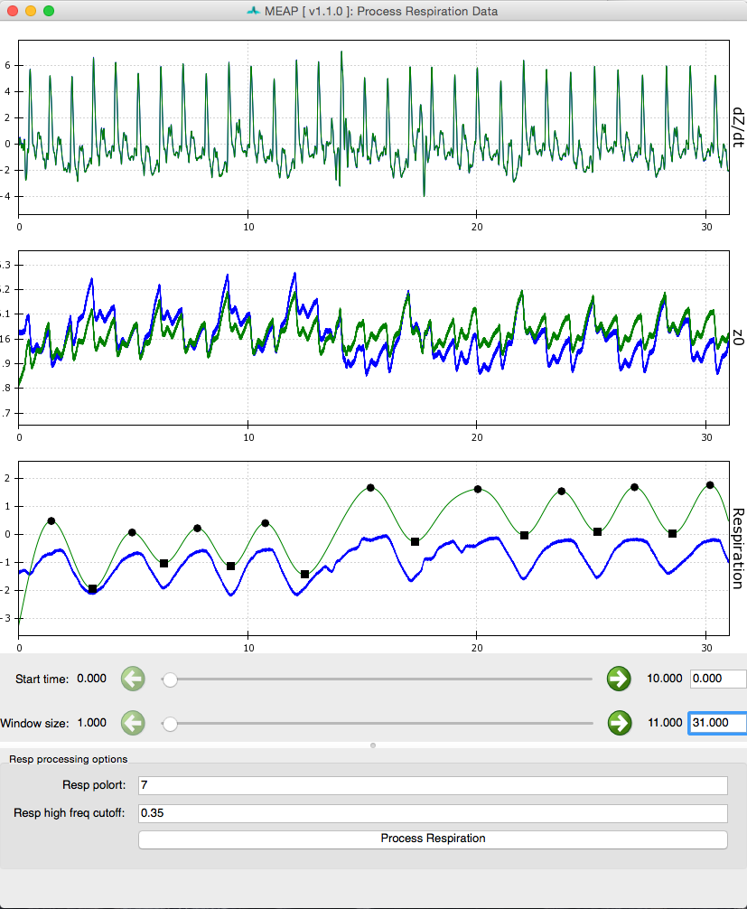
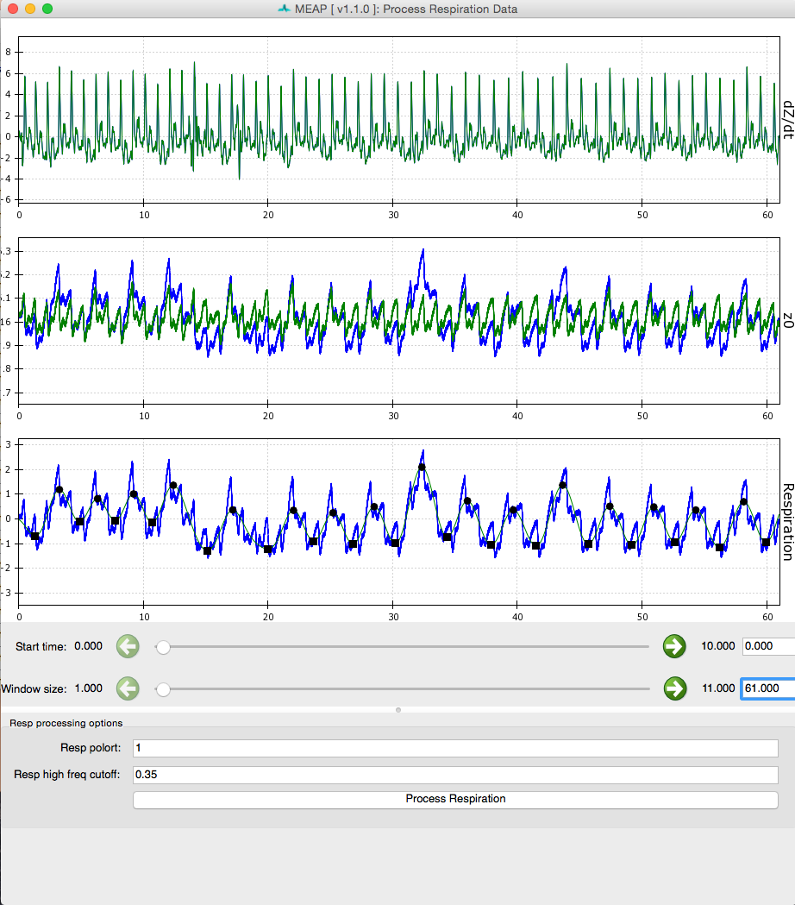
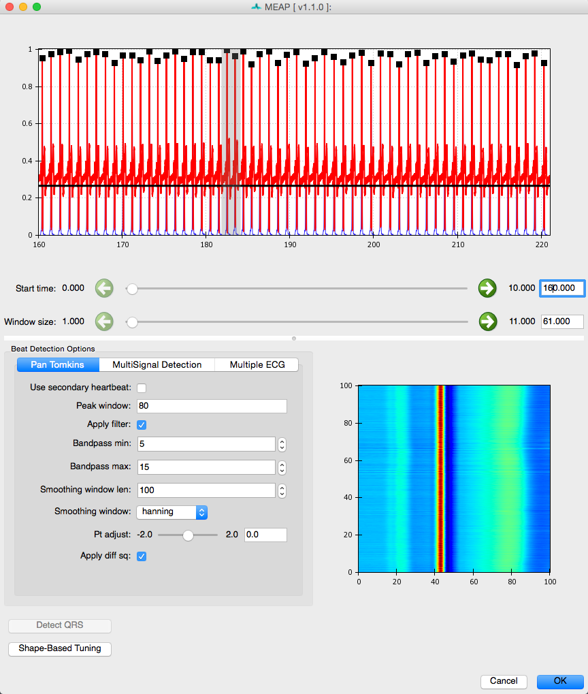

MEAP Tutorial 
=============================

.. toctree::
   :hidden:

Part I: Preprocessing Your Data
================================

Step 1: Creating your Input File
~~~~~~~~~~~~~~~~~~~~~~~~~~~~~~~~~	
.. note:: MEAP also allows the user to input individual files one-by-one. However, when 
	batch processing data we recommend creating an input file as specified below. For more
	on importing files individually, see Step 2: Importing & Mapping the Channels below. 

The first step is to create an input file that tells MEAP where the data you want to analyze is stored. 
MEAP can accomodate both AcqKnowledge (``.acq``) and matlab (``.mat``) files. Each file should 
contain the cardiovascular reactivity data collected from one participant 
including electrocardiogram (ECG), impedance (IKG), blood pressure (BP) waveforms , and
respiration (optional). Data must be collected continuously and sampled at at least 1,000 HZ. 

.. warning:: DON'T USE COMMAS IN YOUR FILE NAMES

In addition to the data file(s) you are scoring, you will need to create a comma separated 
text file (.csv) or excel file (.xlsx) that contains the path to each data file to be scored. 
This file will be used to import the data for initial preprocessing. Later you will create 
a design file that contains information specific to your experimental design and analysis 
method. This initial input file MUST contain the columns containing the following
information labeled as such:

	1. **File** - specify the full path to each file to be scored
	2. Inter-electrode distances- 
	
			A. When using a mylar band configuration label columns:
			  **electrode_distance_front** - the distance between impedance electrodes on the front of the torso. 
			  
			  **electrode_distance_back** - the distance between impedance electrodes on the back of the torso. 
			B. When using a spot electrode configuration label columns:
			  **electrode_distance_left** 
				 
			  **electrode_distance_right** and enter the corresponding measurements.

.. note:: All measurements must be in centimeters.

For a complete list of input file options 
see :ref:`participant-parameters`.

Here is an example input file:

.. figure:: _static/input_excel_file.png
   :scale: 80 %
   :alt: excel input file
   :align: center
   
To add the file paths more quickly create columns for study condition, task, and 
any other variables relavant to your design. Name your Acknowlege files based on these
values and use excel's **CONCATENATE** function to populate the file path. For example, 
here the path for the first row of data is CONCATENATE = ("/Users/Will/Documents/Coldpress 
Scoring/", A2, "_", D2, "s.acq"). Simply drag this equation down the column to
populate the rest of the file paths.

.. warning:: If you have a lot of data, it may be best to create several smaller input files 
	with only a subset of your participants or cases. This will reduce the amount of data that
	MEAP has to load at one time and can prevent the program or your computer from crashing 
	or running slowly. 
   

Step 2: Importing Data & Mapping the Channels
~~~~~~~~~~~~~~~~~~~~~~~~~~~~~~~~~~~~~~~~~~~~~~~~
When you launch MEAP, you will see a window that looks like this:

Click on the folder in the upper right corner to navigate to your input file. Information 
from this spreadsheet will be called and a window will appear that contains all of your files 
to be scored and also serves as the primary user interface. Files to be processed appear in white. 
Once you finish the preprocessing pipeline and save as ``.mea.mat`` file, the row will turn light blue. 
The file currently being processed appears in dark blue. 

To import files individually, right click within the "Input Physio file" portion of the 
window and select **Add New Item**. Then click within the blank line that appears and then 
navigate to the file you wish to score using the blue folder icon to the right of the *File*
field. 

  .. figure:: _static/preproc_window.png
   :scale: 80 %
   :alt: preprocessing window
   :align: center 
   
Now select the first file you would like to process. Then click on the **Import data** 
button at the right of the screen to begin preprocessing.

.. figure:: _static/import_data.png
   :scale: 60 %
   :alt: import data
   :align: center

Once your Aqcknowledge or matlab file is imported you'll need to let MEAP know which 
channel contains each data source. This is achieved by specifying the data contained 
within each channel using this GUI: 

.. figure:: _static/import_channels.png
   :scale: 40 %
   :alt: import channels
   :align: center

The channel names from your data file appear on the left. Match these with the data types
specified in the dropdown menus on the right.  If blood pressure data was collected using 
a wireless blood pressure system or other system that generates separate channels for 
diastolic and systolic blood pressure, map each of these accordingly; systolic and diastolic 
are both options in the drop down menu. Any remaining channels that you do not wish to 
import data from should be set to *None*. 

Regardless, of the number of channels that appear in the ``.acq`` file and their names, you 
should have the following channels mapped: 
	
	1. **ECG** - Electrocardiogram data 
	2. **z0** - Magnitude of impedance 
	3. **bp** - Blood pressure (or systolic and diastolic)
	4. **dzdt** - First derivative of impedance magnitude (used to calculate MAP and TPR).
	5. **respiration**- breath data (optional)
	

This window also contains a tab in which you can specify or correct the participant's
measurements. The inter-electrode distances are imported directly from your input file as is
any other information you specified including height, weight, respiration circumference, 
and whether data was collected during Magnetic Resonance Imaging (MRI). This latter 
specification in critical as MEAP utilizes a customized point-marking algorithm for data
collected within the scanner. 

.. figure:: _static/measurements.png
   :scale: 40 %
   :alt: participant measurements
   :align: center

When importing files individually you MUST manually enter the participant measurements here.
These values can also be edited after the fact by clicking on the **Subject Info** button. 

For more information on these parameters and how to specify them in your input file 
see :ref:`participant-parameters`.

   
Step 3: Check the Quality of Your Waveforms
~~~~~~~~~~~~~~~~~~~~~~~~~~~~~~~~~~~~~~~~~~~~
Now that you have specified the type of data contained within each channel and updated 
participant measurements as desired, click on the **Inspect data** button at the bottom 
of the GUI.

.. figure:: _static/inspect_data.png
   :scale: 80 %
   :alt: inspect data button
   :align: center

MEAP will load and display the data in a GUI like this:

.. figure:: _static/inspect_all.png
   :scale: 70 %
   :alt: inspect all acq data
   :align: center

This feature is designed to allow the user to check the quality of the data, remove outliers, 
and flag any segments of data that contain noise or artifacts or that the researcher would 
like to exclude from analyses for whatever reason. Flagged sections will then be removed from 
all future analysis steps including point marking and ensemble or moving ensemble averaging. 

.. Warning:: It is critical that all data included in calculations be as clean as possible. 
	Attempting to analyze data with significant artifacts will not yield interpretable values. 

**Windsorizing: Removing Extreme Outliers** 

The first thing to do when inspecting your data is to Windsorize outliers, if necessary. 
For example, the Z0 signal may drop to zero at the beginning or end of a file leading the wave 
form to appear small and uncentered in the window, as shown in image above. Such extreme 
outliers can be removed by selecting the **Windsorize** button next to the waveform that 
contains outliers and setting the maximum and minimum cutoffs for outliers. For example, 
setting both the max and min values to .005 means that you are pulling in the top and bottom 
0.5% of the data to just inside that cutoff. You may need to adjust one or both of these 
parameters depending on the outliers contained within your data. Ideally, you want to set
these cutoffs so that you are removing only extreme outliers and not any meaningful data. 
If Windsorizing leads to your waveforms appearing truncated, set lower cutoff values. If 
you don't see your window update, check and uncheck the **Windsorize** button for that 
waveform. 

Post-windsorizing your Z0 data should look like this: 

**Censor Regions: Removing Noise & Aritfacts**

Next, use the *Window size* slider at the bottom of the screen to select a widow size that 
optimizes viewing your data. We recommend a window size of between 20 and 60 seconds to 
allow the user to clearly visualize each waveform and inspect it for anomalies. 

Like so:

Using the *Start time* slider you can scroll through the length of your data file. 
You'll notice that if you start at time 0 and move the slider to the far right, you
do NOT reach the end of the file (unless it is very short). To do this you must use the 
green arrows to increase the sensitivity of the slider by a factor of 10 each time. 
Alternatively, you can jump to a specific time point by entering it into the box to the right.

As you scroll through, look for any sections where the waveform deviates significantly 
from it's canonical shape. 

Artifacts can look like this, where the signal drops off or shoots up beyond expected values:

 .. figure:: _static/zoom_artifact.png
   :scale: 90 %
   :alt: censor regions 1
   :align: center

Artifacts can also look like this, where the signal deviates from its canonical shape, although
values do not appear out of bounds:

 .. figure:: _static/zoom_artifact2.png
   :scale: 45 %
   :alt: censor regions 2
   :align: center

Artifacts are most likely to occur in the dz/dt signal, but may occur in any of the data streams.

.. Note:: For more info on what wave forms should look like, see :ref:`physiological data`

Whenever you come across an area of noise like this, you will want to remove it from 
analyses by censoring it out. This is accomplished using the *Censor* buttons to the right 
of each signal. Select the button that matches the waveform you wish to edit and use
your curser to highlight the region you would like to exclude. If you would like to remove
multiple regions, simply click on the *Censor dz/dt* again and select another region. To 
censor regions on additional waveforms, simply select the relevant *Censor* button and 
highlight the region.

 .. figure:: _static/censor.png
   :scale: 90 %
   :alt: censor regions 1
   :align: center
   
Do this as necessary for each waveform. If a region is censored out on one waveform (the 
*dz/dt* wave, for example) this same time interval is censored out of all other waves as 
well. Therefore, if artifacts occur in multiple waveforms simultaneously, it is not necessary 
to censor them separately on each waveform (as in the image above). This means that if one 
signal is bad throughout it is best not to edit this out, but to leave it and remove calculated 
values later in the analysis pipeline. For example, if BP data is bad throughout this 
approach will allow you to still analyze the impedance and ECG data. Without good ECG data, 
however, MEAP cannot calculate and align cardiac cycles and analysis will not be possible. 

.. Note:: This editing feature can also be employed to remove epochs of data that the 
   researcher does not wish to include in analyses. 

Once you are satisfied with the regions to be removed, select *OK*. 

This is a good time to save your work. To do so, copy the *File* path and paste it into 
the *Outfile* field and change the file type from ``.acq`` to ``.mea.mat``, then click
**Save .meap file**. 

Step 4: Processing Respiration Data
~~~~~~~~~~~~~~~~~~~~~~~~~~~~~~~~~~~~~

If you collected respiration data as part of your study MEAP can calculate the number of
breaths. MEAP can also calculate breath rate from the ICG data. Additionally, by processing 
respiration in this way the user can remove the low frequency fluctuation in ICG signals 
due to respiration rather than changes in blood flow. Because the torso expands with each 
inhalation, the respiration cycle impacts impedance data in ways that may or may not be of 
interest to the researcher. 

Select **Process Resp**: 

.. figure:: _static/process_resp.png
   :scale: 50 %
   :alt: process respiration
   :align: center

This will load a window like the one below which shows dz/dt, Z0, and respiration waveforms.

Click the **Process Respiration** button at the bottom of the screen and MEAP will use either
the measured respiration signal or low frequency components of the ICG wave to determine 
respiration rate and remove its influence on the dz/dt and Z0 waveforms. The blue lines 
represent raw data and green represents data with variation due to respiration removed. Black 
dots mark inhalation and exhalation. 

   
Sliders can be used to change the size and start point of the viewing window just like at 
the *Inspect Data* step.

Processed respiration using measured respiration signal:

Processed respiration using dz/dt waveform:

After respiration has been processed, simply close the window and proceed to the next step. 

Step 5: Detecting R-Peaks 
~~~~~~~~~~~~~~~~~~~~~~~~~~

Now that you have loaded your data, checked its quality, and removed areas of artifact, 
the next step is to detect each heartbeat. Click on the **Detect QRS Complexes** button.
MEAP automatically detects each R-peak using a modified Pan-Tomkins algoritm (for more 
information on the Pan-Tompkins method see :ref:`beat-detector`) 

Each R peak on the ECG wave is marked with a black square.

.. figure::  _static/qrs_all.png
   :scale: 80%
   :alt: beat detector 1
   :align: center

Again, the sliders below the displayed data allow the user to scroll through the 
file and change the window size.

If you censored any ECG data in the previous step, the R-peaks that fall 
within this region will be ignored. R-peaks in regions censored due to noise in other signals will 
still be detected. 

.. figure::  _static/removed_qrs.png
   :scale: 80%
   :alt: no R-peaks in censored regions
   :align: center

The bottom right corner of this window displays a topographical image of all detected R-peaks.
This image displays all R-peaks aligned with one another and viewed from above. The peak of
each waveform appears in red while troughs appear in blue. This image allows the user to 
easily visualize the data and whether R-peaks have been correctly detected. When R-peaks are
incorrectly marked, this image will apear jumbled rather than stripes of color corresponding
to the topography of the canonical ECG waveform. 

In most cases the default settings will allow for accurate detection of each R-peak. 
Depending on the noisiness of the data and/or idiosyncratic differences in waveform shape, 
however, the user may need to adjust the default settings. Adjustments are usually required
only where a participant has a very high t-wave or where there is significant respiration 
or other artifact. 

The beat detector GUI allows the user to edit the parameters of a modified Pan Tomkins 
QRS detector in order to more accurately mark the R-peaks in cases such as those just
described. The most likely change you will need to make is to change the **Pt adjust**
setting to be slightly higher or lower. If it is falsely detecting t-waves as peaks, 
adjust it up, if true R-peaks are being missed, adjust it down. Usually a change of .05 
to .1 does the trick. Don't forget if you sensored regions previously, R-peaks that fall
within these regions will not be marked. 

If there is an R-peak that is incorrectly marked due to noise that you missed in the 
previous step, you can remove this point now. Simply click within the portion of the window
displaying each R-peak. The squares marking these will change from black to yellow. Use the
mouse to highlight the are surrounding any points you want to remove (just like in the *edit
data* step above.

.. figure::  _static/edit_r_peaks.png
   :scale: 50%
   :alt: no R-peaks in censored regions
   :align: center

You can also mark individual R-peaks as needed by right clicking where you wish to an R-point. 
	
.. Note:: For more information on the Pan-Tompkins method and parameter options, 
	see the :ref:`beat-detector` section of this documentation. 

Step 6: Marking Custom Points
~~~~~~~~~~~~~~~~~~~~~~~~~~~~~~

This window displays an ensemble averaged waveform for the entire data file. Using a classifier
derived from previous data, MEAP has attempted to mark each of the relevant inflection points
on this waveform. For each point, the relative timing and point type are listed in the left panel. 

**For Example:**

.. figure::  _static/global_ens_avg.png
   :scale: 50%
   :alt: point_marking_incorrect
   :align: center

It is the job of the user to examine these points, determine whether each is marked in the
correct location, and to adjust their placement where necessary.

For example, in this case placement of the B-point is slightly high and the Q and S -points
are not quite at the minimum. Correcting these issues, the heuristic ensemble should look like this:

.. figure::  _static/global_ens_avg_fixed.png
   :scale: 50%
   :alt: point_marking_correct
   :align: center
   
.. warning:: If you cannot find where one of the points is marked, it may be hidden beneath
	one of the other points. Occasionally with messy data one point will be placed on top of 
	one another such that one is not visible. 
   	  
Once each point is marked on the ensemble averages, MEAP will use these values to update
it's classifier and determine where to look for and mark the corresponding points at each 
individual ensemble average or beat (depending on type of analysis). 

.. Note::  For more examples of correct point placement, see :ref:`mark-custom-points`.
   
When you are satisfied with the placement of each point on the heuristic ensemble average,
simply close the window and proceed to the next step.

Step 7: Compute Moving Ensembles
~~~~~~~~~~~~~~~~~~~~~~~~~~~~~~~~~

This feature of MEAP is not yet fully functional, but is not necessary for traditional 
ensemble averaging analyses. For now, simply click on this function and press ok before 
proceeding to the next (and final) step of preprocessing.

Step 8: Save Your Preprocessed File
~~~~~~~~~~~~~~~~~~~~~~~~~~~~~~~~~~~~~~~~~~~

Save your Work! If you have not done so already, copy the *File* path and paste it into 
the *Outfile* field and change the file type from ``.acq`` to ``.mea.mat``, then click
**Save .meap file**. 

The file you just preprocessed should now be highlighted in blue. Proceed to the next file
and repeat these steps until you have scored the data for all of your subjects. 

To improve processing speed click the **Clear Memory** button to clear the memory cache 
before proceeding to the next file. 

PART II: Calculating Ensemble Averages
============================================================

MEAP will then visit each detected heartbeat and label the points on it. Using
these points, MEAP then calculates the following cardiovascular indices:

	1. **Total Peripheral Resistance** (TPR)
	2. **Cardiac Output** (CO)
	3. **Stroke Volume** (SV)
	4. **Pre-Ejection Period** (PEP)
	5. **Mean Arterial Pressure** (MAP)
	6. **Heart Rate** (HR)
	7. **Heart Rate Variability** (HRV) 

Step 1: Create a Design Spread Sheet
~~~~~~~~~~~~~~~~~~~~~~~~~~~~~~~~~~~~~~~~

This should specify your subjects, your experimental design, and the path to the ``mea.mat``
files that you preprocessed:

.. figure::  _static/design_file.png
   :scale: 60%
   :alt: design spreadsheet
   :align: center
   
Exactly how this file should be set up will depend on the length of the ensemble average 
window you are using and on other specifics of your study design. 

This same file is also where your data will ultimately be printed. Thus it serves as both 
the input and output file for this stage of the scoring process. 

Step 2: Open Ensemble Average GUI
~~~~~~~~~~~~~~~~~~~~~~~~~~~~~~~~~~~~~~

The Ensemble Average GUI allows the user to visualize each ensemble average (duration 
specified in your excel file) as well as the values for key indices (B-point, PEP, LVET)
for all subjects, for a specific subject only, or for a specific data file only. 

In the top right corner is an ICA plot which takes all of the features of the ensemble 
averages into account and then plots them in two dimensions based on their covariance. 

.. figure::  _static/ensembles_all.png
   :scale: 80%
   :alt: EA GUI
   :align: center

Using the column headers you can sort by subject, event, or by "oddity index" which reflects
that EAs distance from the center of the ICA plot. This allows you to quickly identify
problematic EAs.

.. figure::  _static/sort_by_oddity.png
   :scale: 80%
   :alt: Oddity
   :align: center

Perhaps this ensemble average (pointed to in the ICA plot) is due to a bad B-point. We can 
check the subject's B-points in the bottom right plot by selecting their subject ID. Aha
the B-point is misplaced. We see this in the waveform plot on the bottom left and the B-point
plot on the bottom right. 

.. figure::  _static/bad_bpoint.png
   :scale: 80%
   :alt: Bad B
   :align: center

By dragging the B-point to the correct location we see the outlier goes away in the subject's
plot. 

.. figure::  _static/fixed_bpoint.png
   :scale: 80%
   :alt: Fixed B
   :align: center
   
If MEAP's automatic point marker fails to mark a point, the event ID column will be highlighted 
in magenta. If you then click on that EA, the point that failed will be highlighted in red.

.. figure::  _static/magenta_failed_point_warning.png
   :scale: 80%
   :alt: EA GUI
   :align: center
   
If the EA is too messy to correctly identify points, it can be removed from analyses by 
unchecking the "usable" button in the bottom left corner. 
   
Step 3: Save Your Work
~~~~~~~~~~~~~~~~~~~~~~~~~~~~~~~~~~~~~~

Click the "Save Results" button in the upper right corner of the GUI to save your work. 
Do this frequently as you are working. All of your custom point markings will be saved and 
you can reload and return to them by using the newly created output spreadsheet as input. 

PART III: Analyzing your Scored Data
============================================================

At this point you have completed the data scoring process. You now have a ``.csv`` file 
with values for each cardiovascular index for each ensemble average. Your data should 
look something like this:

.. figure::  _static/data_output.png
   :scale: 60%
   :alt: Data Output
   :align: center
   
.. warning: If you cannot open the output file on your computer, try downloading
	**Open Office** and opening the file with that program. You can then copy and paste
	that data back into excel or save it in the format of your choice.
	
You are now ready to move this data into whatever statistical software you prefer for analyses.
Depending on what type of analyses you wish to conduct you may need to reformat the data. 
As it is, the data appears in *long format* with multiple rows of data for each subject. 
Some analyses require *wide format* where each subject has only one row of data but multiple
variables for each cardiovascular index reflecting the values for each ensemble average. 

Again, depending on your study design and the analyses you wish to conduct you may want to
create reactivity values that reflect values for each index minus baseline values (E.g. 
CO_min1 - CO_BL). All analyses and data transformations are done outside of MEAP in your
statistical software of choice. You should also use this software to check for outliers
or any other issues with your data. 